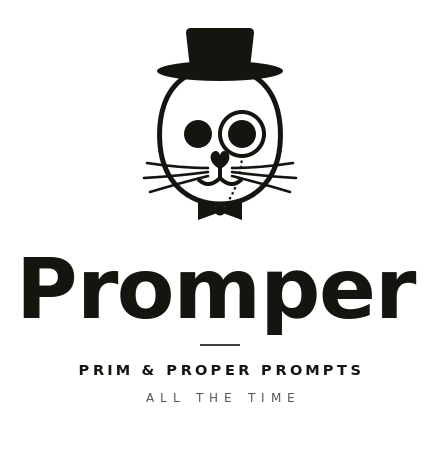

<p align="center">
  <picture>
    <source media="(prefers-color-scheme: dark)" srcset="assets/promper-stacked-light.svg">
    
  </picture>
</p>

# promper

Promper is a prompt-engineering toolkit for Claude Code. It ships two commands:

- **`/promper <intent>`**: turns a rough request into a clean, **role-grounded** prompt.
- **`/prim`**: grades your agents against the prompt-engineering standard and hands out the "seal of approval".

## The idea

Here's the bet. invokerai already routes every task, solo or multi-domain, to the right specialist agent. And those agents *are* prompt engineering: each one's system prompt is a persona tuned for its domain. So the best `<role>` for your prompt isn't something you guess ("you are an expert…"). It's the agent invokerai would have picked anyway. promper just borrows it.

```
raw intent
  → invokerai decompose + spawn   →  selects the proper agent(s)
        → agent persona            ⇒  <role>   (inherited, not invented)
  → Prompt Engineer agent fills the rest around that role
        <context> <instructions> <examples> <constraints> <output_format>
  → engineered prompt(s)
```

**Who does what:** promper *makes* the prompt · invokerai *routes* to the agent · the agents *are* the roles · prim *guards* them (it certifies the agents those roles come from).

## /promper

```
/promper write a tweet announcing my budgeting app
```

- **Portable (default):** you get a standalone, copy-paste prompt with the persona baked in. Take it anywhere.
- **`--run`:** promper engineers the prompt, then spawns the selected agent(s) and runs it (invokerai plus a prompt-polish pass).
- Flags: `--agent=<name>` to override the pick · `--target=portable|costar` · `--deep` to hand the whole job to the Prompt Engineer agent.

The default skeleton is Claude-native XML. Pass `--target=costar` to emit CO-STAR for portable or non-Claude prompts.

## /prim

<p align="center">
  <picture>
    <source media="(prefers-color-scheme: dark)" srcset="assets/promper-seal-icon-bowtie-light.svg">
    
  </picture>
</p>

```
/prim                # pick agents to evaluate
/prim --all          # evaluate all (still confirms once)
/prim my-writer --fix
```

prim scores each approved agent 0–100 against the rubric, lists P0/P1/P2 findings with fixes, and writes a seal (`score ≥ 80 AND zero P0`) to `~/.claude/agents/.prim-seal.json`. Add `--fix` and it rewrites the agents that fail. That part is gated: you see a per-file diff and confirm each one. It also won't silently edit plugin-provided agents (those revert on `/plugin update`), so it offers you an override copy instead.

promper reads the prim ledger, so when it's about to inherit a role from an uncertified or weak agent, it warns you first.

## Layout

```
promper/
  .claude-plugin/      plugin.json + marketplace.json
  skills/
    promper/SKILL.md   the "make" skill
    prim/SKILL.md      the "evaluate / certify" skill
  reference/
    pe-principles.md   shared source of truth (11 principles, XML skeleton, rubric)
```

## Install / use

Quickest path, one command:

```
npx @ninjamin/promper
```

That copies the `promper` and `prim` skills into `~/.claude/skills/`. Restart Claude Code and `/promper` and `/prim` resolve.

**Local dev:** the two skills are symlinked into `~/.claude/skills/`, so the commands resolve directly while you hack on them (restart Claude Code to pick up new commands). The repo stays the single source of truth: the symlinks point back at `skills/promper` and `skills/prim`, so there's no second copy to drift.

> Needs [invokerai](https://github.com/justjammin/invokerai) installed (`~/.claude/skills/invokerai/`) with a built agent map at `~/.invoker/agent-map.json`. The `<role>` inheritance depends on it.

> **Heads up:** promper is allowed to call [invokerai](https://github.com/justjammin/invokerai) directly. That's a deliberate exception to the usual "skills don't call invokerai" rule, because driving invokerai's routing to inherit roles is the whole point.

## License

Apache-2.0
