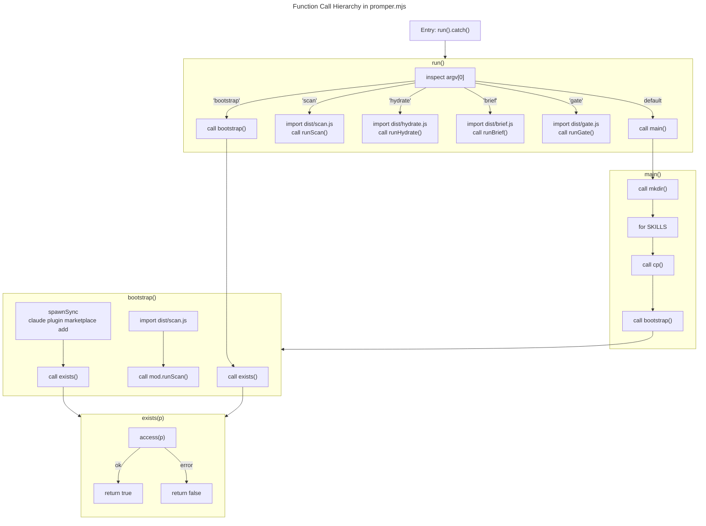

# C4 Code Level: bin — Promper CLI Entry Point

## Overview

- **Name**: Promper CLI Entry Point
- **Description**: Single-file Node.js ESM CLI router that handles `npx promper` installation flow, bootstraps the wshobson/agents marketplace as a hard dependency, and dispatches to subcommands (scan/hydrate/brief/gate)
- **Location**: `bin/promper.mjs`
- **Language**: JavaScript (Node.js 18+, ESM)
- **Purpose**: Install promper and prim skills into ~/.claude/skills, ensure marketplace role source is configured, and provide CLI dispatch to compiled build artifacts (dist/*.js modules)

## Code Elements

### Functions

#### `exists(p: string): Promise<boolean>`

- **Description**: Checks if a file or directory path exists by attempting to access it. Returns true on success, false if access fails.
- **Location**: `bin/promper.mjs:23-25`
- **Parameters**:
  - `p: string` - File or directory path to check
- **Return Type**: `Promise<boolean>` - Resolves to true if path exists, false otherwise
- **Dependencies**: Uses `node:fs/promises.access()`
- **Implementation**: Try/catch wrapper around fs.access(); catches any exception and returns false

#### `bootstrap(): Promise<boolean>`

- **Description**: Ensures wshobson/agents marketplace is registered as a plugin and scans it to populate the role source. First checks if marketplace cache exists; if missing, spawns `claude plugin marketplace add` subprocess. Then dynamically imports scan.js and runs marketplace scan.
- **Location**: `bin/promper.mjs:28-56`
- **Parameters**: None
- **Return Type**: `Promise<boolean>` - Resolves to true on success, false if marketplace could not be added
- **Dependencies**:
  - `exists()` (internal call, line 31, 36)
  - `spawnSync()` from `node:child_process` (line 33)
  - Dynamic import of `../dist/scan.js` (line 49)
- **Side Effects**:
  - Creates marketplace cache directory if missing
  - Spawns subprocess: `claude plugin marketplace add wshobson/agents`
  - Calls `mod.runScan()` with marketplace cache path
  - Logs to console (lines 32, 54)
  - Logs warning to stderr if marketplace add fails (line 37)
- **Error Handling**: 
  - Catches module import error and throws with descriptive message (line 51)
  - Returns false if marketplace addition fails or cache still missing after attempt

#### `main(): Promise<void>`

- **Description**: Installation routine that copies promper, promper-setup, and prim skills from the source directory to ~/.claude/skills and bootstraps the marketplace.
- **Location**: `bin/promper.mjs:58-71`
- **Parameters**: None
- **Return Type**: `Promise<void>`
- **Dependencies**:
  - `mkdir()` from `node:fs/promises` (line 59)
  - `cp()` from `node:fs/promises` (line 64)
  - `bootstrap()` (internal call, line 68)
  - Constants: `dest`, `root`, `SKILLS` (lines 59-66)
- **Side Effects**:
  - Creates ~/.claude/skills directory if missing (line 59)
  - Copies three skill directories recursively with force overwrite (line 64)
  - Logs installation progress to console (line 65, 70)
  - Invokes bootstrap() to set up marketplace
- **Error Handling**: Throws on mkdir/cp failures; does not catch

#### `run(): Promise<void>`

- **Description**: Main CLI dispatcher. Inspects first command-line argument and routes to appropriate subcommand handler: bootstrap, scan, hydrate, brief, or gate. Passes remaining argv to respective handler. Falls back to main() if no recognized subcommand.
- **Location**: `bin/promper.mjs:73-121`
- **Parameters**: None (reads from `process.argv`)
- **Return Type**: `Promise<void>`
- **Dependencies**:
  - `process.argv` (line 74)
  - Dynamic imports: `../dist/scan.js`, `../dist/hydrate.js`, `../dist/brief.js`, `../dist/gate.js` (lines 83, 93, 103, 113)
  - Internal calls: `bootstrap()`, `main()` (lines 76, 120)
- **Side Effects**:
  - Calls appropriate `runX()` function from imported modules
  - Exits process with code 1 if bootstrap fails (line 77)
  - Dispatches argv.slice(1) to handler modules (lines 87, 97, 107, 117)
- **Error Handling**:
  - Catches module import errors and throws with descriptive message
  - Exits with status 1 on bootstrap failure (line 77)

#### `run().catch()` — Global Error Handler (Line 123-126)

- **Description**: Wraps run() invocation with global error catch. Logs error message to console and exits process with status 1.
- **Location**: `bin/promper.mjs:123-126`
- **Error Handling**:
  - Catches any unhandled promise rejection from run()
  - Formats error as: `promper failed: <error.message>`
  - Exits process with code 1

### Constants

| Name | Type | Value | Purpose |
|------|------|-------|---------|
| `SKILLS` | `string[]` | `["promper", "promper-setup", "prim"]` | Skill directories to copy from source to ~/.claude/skills |
| `MARKETPLACE_REPO` | `string` | `"wshobson/agents"` | GitHub repository for agent role source |
| `MARKETPLACE_NAME` | `string` | `"claude-code-workflows"` | Declared marketplace name in Claude marketplace registry |
| `root` | `string` | Derived from `import.meta.url` via `dirname(fileURLToPath(...))/..' ` | Project root directory (parent of bin/) |
| `dest` | `string` | `join(homedir(), ".claude", "skills")` | Target installation directory for skills |

## Dependencies

### Internal Dependencies

- **../dist/scan.js** — Dynamically imported by `bootstrap()` (line 49) and `run()` (line 83); exports `runScan(argv: string[]): Promise<void>` function
- **../dist/hydrate.js** — Dynamically imported by `run()` (line 93); exports `runHydrate(argv: string[]): Promise<void>` function
- **../dist/brief.js** — Dynamically imported by `run()` (line 103); exports `runBrief(argv: string[]): Promise<void>` function
- **../dist/gate.js** — Dynamically imported by `run()` (line 113); exports `runGate(argv: string[]): Promise<void>` function

All four modules are built compilation targets from TypeScript source and are loaded on-demand based on CLI subcommand.

### External Dependencies

| Module | Usage | Source |
|--------|-------|--------|
| `node:fs/promises` | `cp()` — copy skill directories (line 11, 64); `mkdir()` — create dest directory (line 11, 59); `access()` — check path existence in exists() (line 11, 24) | Node.js built-in |
| `node:child_process` | `spawnSync()` — run `claude plugin marketplace add` subprocess (line 12, 33) | Node.js built-in |
| `node:os` | `homedir()` — get user home directory for ~/.claude paths (line 13, 21, 29) | Node.js built-in |
| `node:url` | `fileURLToPath()` — convert ESM import.meta.url to file path (line 14, 20) | Node.js built-in |
| `node:path` | `dirname()` — extract directory from file path (line 15, 20); `join()` — construct file paths (line 15, 20, 21, 29, 62, 63) | Node.js built-in |

## Relationships

```mermaid
---
title: CLI Dispatch Flow — Promper Entry Point
---
flowchart TD
    subgraph Entry["Entry Point"]
        ARGV["process.argv"]
        CATCH["Global Error Handler<br/>(run().catch)"]
    end
    
    subgraph CliDispatcher["CLI Dispatcher (run)"]
        DISPATCH["route(argv[0])"]
        BOOTSTRAP_CMD["'bootstrap'<br/>subcommand"]
        SCAN_CMD["'scan'<br/>subcommand"]
        HYDRATE_CMD["'hydrate'<br/>subcommand"]
        BRIEF_CMD["'brief'<br/>subcommand"]
        GATE_CMD["'gate'<br/>subcommand"]
        INSTALL["no subcommand<br/>→ install"]
    end
    
    subgraph Bootstrap["Bootstrap Flow"]
        CHECK_CACHE["exists<br/>marketplace cache"]
        ADD_REPO["spawnSync<br/>claude plugin marketplace add"]
        SCAN_LOAD["import dist/scan.js"]
        RUN_SCAN["runScan<br/>--plugins cache<br/>--no-defaults"]
    end
    
    subgraph Install["Installation Flow"]
        MKDIR["mkdir<br/>~/.claude/skills"]
        COPY["cp SKILLS<br/>promper/prim/<br/>promper-setup"]
        INIT_BOOTSTRAP["bootstrap()"]
    end
    
    subgraph Modules["Compiled Modules"]
        SCAN_MOD["dist/scan.js<br/>runScan()"]
        HYDRATE_MOD["dist/hydrate.js<br/>runHydrate()"]
        BRIEF_MOD["dist/brief.js<br/>runBrief()"]
        GATE_MOD["dist/gate.js<br/>runGate()"]
    end
    
    ARGV -->|invokes| DISPATCH
    DISPATCH -->|argv[0]='bootstrap'| BOOTSTRAP_CMD
    DISPATCH -->|argv[0]='scan'| SCAN_CMD
    DISPATCH -->|argv[0]='hydrate'| HYDRATE_CMD
    DISPATCH -->|argv[0]='brief'| BRIEF_CMD
    DISPATCH -->|argv[0]='gate'| GATE_CMD
    DISPATCH -->|no match| INSTALL
    
    BOOTSTRAP_CMD --> CHECK_CACHE
    CHECK_CACHE -->|not found| ADD_REPO
    ADD_REPO --> SCAN_LOAD
    SCAN_LOAD --> RUN_SCAN
    
    INSTALL --> MKDIR
    MKDIR --> COPY
    COPY --> INIT_BOOTSTRAP
    INIT_BOOTSTRAP --> Bootstrap
    
    SCAN_CMD --> SCAN_LOAD
    SCAN_LOAD --> SCAN_MOD
    HYDRATE_CMD --> HYDRATE_MOD
    BRIEF_CMD --> BRIEF_MOD
    GATE_CMD --> GATE_MOD
    
    Bootstrap -->|success| EXIT["exit 0"]
    Bootstrap -->|failure| CATCH
    CATCH --> EXIT_1["exit 1"]
    Install --> EXIT
```

### Call Flow Diagram



## Code Execution Paths

### Path 1: Installation (default, no arguments)

```
npx promper
  → run()
    → main()
      → mkdir(~/.claude/skills)
      → for each skill in ["promper", "promper-setup", "prim"]
         → cp(source, dest, recursive, force)
      → bootstrap()
        → exists(marketplace cache)
        → [if not] spawnSync("claude plugin marketplace add wshobson/agents")
        → exists(marketplace cache) [verification]
        → import("../dist/scan.js")
        → runScan(["--plugins", cache, "--no-defaults"])
```

### Path 2: Bootstrap Only

```
promper bootstrap
  → run()
    → bootstrap()
      → exists(marketplace cache)
      → [if not] spawnSync("claude plugin marketplace add wshobson/agents")
      → import("../dist/scan.js")
      → runScan(["--plugins", cache, "--no-defaults"])
```

### Path 3: Scan Subcommand

```
promper scan [--plugins <root>] [--no-defaults] ...
  → run()
    → import("../dist/scan.js")
    → runScan(argv)
```

### Path 4: Hydrate Subcommand

```
promper hydrate <agent> "<task>" [--json] ...
  → run()
    → import("../dist/hydrate.js")
    → runHydrate(argv)
```

### Path 5: Brief Subcommand

```
promper brief "<task>" [--agent <name>] ...
  → run()
    → import("../dist/brief.js")
    → runBrief(argv)
```

### Path 6: Gate Subcommand

```
promper gate "<prompt>" [--transcript <path>] ...
  → run()
    → import("../dist/gate.js")
    → runGate(argv)
```

## Module Coupling

### Tight Coupling
- **promper.mjs → dist/scan.js**: Run-time dependency via dynamic import. Bootstrap hard requires this module for marketplace scan.
- **promper.mjs → process.argv**: Direct dependency on Node.js runtime environment.
- **promper.mjs → ~/.claude directory**: Hard dependency on user's Claude Code config directory for skill installation and marketplace cache.

### Loose Coupling
- **promper.mjs → dist/hydrate.js, brief.js, gate.js**: Only loaded if user invokes respective subcommand; no compile-time dependency.
- **promper.mjs → wshobson/agents marketplace**: Optional at runtime; warns but continues if marketplace cannot be added (graceful degradation).

## Error Handling Strategy

| Error Scenario | Location | Handler | Behavior |
|---|---|---|---|
| dist/scan.js import fails | bootstrap() line 49-51 | throw Error with message | Propagates to run().catch(), exits with code 1 |
| dist/hydrate.js import fails | run() line 93-95 | throw Error with message | Propagates to run().catch(), exits with code 1 |
| dist/brief.js import fails | run() line 103-105 | throw Error with message | Propagates to run().catch(), exits with code 1 |
| dist/gate.js import fails | run() line 113-115 | throw Error with message | Propagates to run().catch(), exits with code 1 |
| mkdir() fails | main() line 59 | no handler | Throws, propagates to run().catch(), exits with code 1 |
| cp() fails | main() line 64 | no handler | Throws, propagates to run().catch(), exits with code 1 |
| marketplace add subprocess fails | bootstrap() line 36-42 | warn to stderr, return false | run() checks return and exits with code 1 |
| Any unhandled promise rejection | run().catch() line 123-126 | Log error, exit(1) | Process terminates with exit code 1 |

## Technology Stack

- **Language**: JavaScript (ECMAScript 2022 / ESM)
- **Runtime**: Node.js 18+ (uses ESM `import` syntax and `import.meta.url`)
- **Process Model**: Synchronous subprocess spawning via `spawnSync()`
- **File I/O**: Promise-based API via `node:fs/promises`
- **Module System**: ES Modules with dynamic `import()` for subcommand handlers

## Notes

- **Shebang**: `#!/usr/bin/env node` (line 1) enables direct execution as CLI binary
- **npx Integration**: Works with `npx @ninjamin/promper` because this file is listed as `bin` entry point in package.json
- **Build Requirement**: All dist/*.js modules must be pre-built from TypeScript source via `npm run build` before CLI can dispatch to them
- **Marketplace as Hard Dependency**: wshobson/agents is essential for promper role discovery; installation halts if marketplace cannot be added, but user can retry with `promper bootstrap`
- **Atomic Skill Installation**: SKILLS array includes promper, promper-setup, and prim; all three installed together with recursive copy + force overwrite to handle updates
- **Console Output**: Uses inline `console.log()` and `console.warn()` for user feedback; no logging framework
