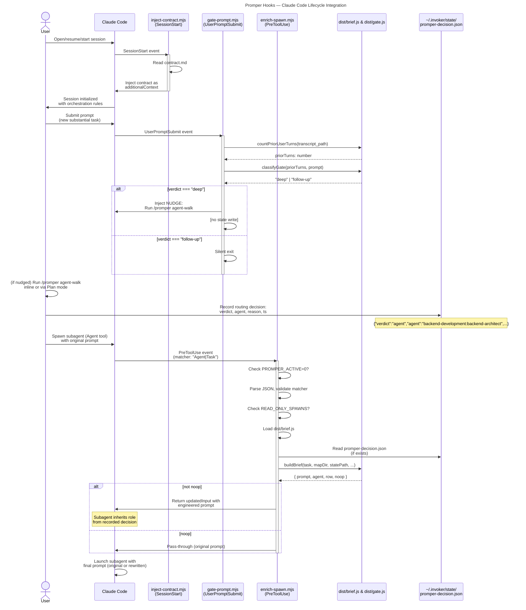

# C4 Code Level: Promper Hooks

## Overview

- **Name**: promper Hook Registry — Claude Code Plugin Hook Layer
- **Description**: Five Node.js ESM hook scripts registering Claude Code lifecycle event handlers (SessionStart, UserPromptSubmit, PreToolUse, SessionEnd) that orchestrate deterministic prompt engineering, agent routing nudges, subagent spawn enrichment, and contract-gate edit enforcement. Zero LLM calls, zero npm dependencies.
- **Location**: `/Users/jammin/Documents/GitHub/promper/hooks/`
- **Language**: JavaScript (Node.js ESM, v18+ required)
- **Purpose**: Inject Claude Code orchestration contract at session start, nudge agent-walk on new substantial tasks, rewrite subagent spawn prompts with role inheritance — all deterministic, all without blocking the main tool chain.

## Architecture & Design

This hooks layer is the runtime enforcement of promper's orchestration philosophy: autonomous agent decomposition, specialist-role inheritance, and deterministic prompt engineering. Each hook:

1. **Fails safe**: malformed input → passThrough (never block real work)
2. **Respects off-switch**: `PROMPER_ACTIVE=0` disables all hooks
3. **Logs diagnostics**: `PROMPER_DEBUG_LOG=<path>` appends JSON trace (zero cost when unset)
4. **Imports at runtime**: dynamic `import(join(HOOK_DIR, "..", "dist", ...))` — graceful degrade if build missing

## Code Elements

### enrich-spawn.mjs

**File**: `/Users/jammin/Documents/GitHub/promper/hooks/enrich-spawn.mjs`

**Purpose**: PreToolUse hook (fires on `Agent` or `Task` tool invocation). Intercepts subagent spawn prompt, rewrites it via `dist/brief.js` to embed role + domain context before the subagent launches. Deterministic. No LLM.

#### Function: `debug(event: string, data: object): void`

- **Signature**: `debug(event, data)`
- **Parameters**:
  - `event` (string): event type (e.g., "pass-through", "rewrote", "brief-failed")
  - `data` (object): diagnostic payload (subagentType, row, agent, reason, etc.)
- **Returns**: void
- **Description**: Append one JSON line to `PROMPER_DEBUG_LOG` file if env var is set. No-op and zero cost when unset. Never throws — debug logging must not break the hook.
- **Location**: enrich-spawn.mjs:19-27
- **Dependencies**: `node:fs.appendFileSync()`

#### Function: `passThrough(reason: string): void`

- **Signature**: `passThrough(reason)`
- **Parameters**:
  - `reason` (string): why the hook exits without mutation (e.g., "PROMPER_ACTIVE=0", "not-a-spawn-event", "dist-missing")
- **Returns**: void (exits with code 0)
- **Description**: Log diagnostic, exit cleanly. Used when hook decides not to mutate input — preserves original tool invocation.
- **Location**: enrich-spawn.mjs:29-32
- **Dependencies**: `debug()`

#### Function: `main(): Promise<void>`

- **Signature**: `async function main()`
- **Parameters**: none
- **Returns**: Promise (resolves to void)
- **Description**: Hook entry point. Orchestrates the flow: check PROMPER_ACTIVE, read JSON from stdin, validate PreToolUse + (Agent|Task) matcher, load `dist/brief.js`, call `buildBrief()`, write JSON to stdout with either original or rewritten prompt. Exits 0 on completion.
- **Location**: enrich-spawn.mjs:34-92
- **Dependencies**: 
  - `process.env.PROMPER_ACTIVE`
  - `process.stdin` (async iterable)
  - `process.stdout.write()`, `process.exit()`
  - dynamic `import(join(HOOK_DIR, "..", "dist", "brief.js"))`
  - `buildBrief(options)` from `dist/brief.js`

**Internals**:
- **READ_ONLY_SPAWNS Set** (line 14): agents that never get rewritten ("Explore", "Plan"). Filter before calling `buildBrief()`.
- **ENGINEERED_MARKER string** (line 15): literal `<instructions>`. If present in task, already engineered → passThrough.
- **Hook Input Schema** (line 47):
  ```javascript
  {
    hook_event_name: "PreToolUse",
    tool_name: "Agent" | "Task",
    tool_input: {
      subagent_type: string | undefined,
      prompt: string | undefined,
      description: string | undefined,
      ... other Agent/Task params
    }
  }
  ```
- **Hook Output Schema** (line 83–89):
  ```javascript
  {
    hookSpecificOutput: {
      hookEventName: "PreToolUse",
      permissionDecision: "allow",
      updatedInput: { ...toolInput, prompt: result.prompt }
    }
  }
  ```
- **buildBrief() Options** (line 67–74):
  ```javascript
  {
    task: string,
    agent: null,
    subagentType: string | null,
    mapDir: string,  // ~/.invoker/map
    statePath: string,  // ~/.invoker/state/promper-decision.json
    json: true
  }
  ```
  Returns: `{ noop: boolean, note?: string, prompt: string, row: object, agent: string }`

---

### gate-prompt.mjs

**File**: `/Users/jammin/Documents/GitHub/promper/hooks/gate-prompt.mjs`

**Purpose**: UserPromptSubmit hook (fires on every user message). Classifies deep-dive (new substantial task) vs follow-up using `dist/gate.js`. On deep-dive, injects nudge to run `promper agent-walk` and record routing decision to `~/.invoker/state/promper-decision.json`. On follow-up, silent passthrough — never nags.

#### Function: `passThrough(): void`

- **Signature**: `passThrough()`
- **Parameters**: none
- **Returns**: void (exits with code 0)
- **Description**: Exit cleanly without injecting context. Used when not a UserPromptSubmit event or when classification is "follow-up".
- **Location**: gate-prompt.mjs:22-24
- **Dependencies**: none

#### Function: `main(): Promise<void>`

- **Signature**: `async function main()`
- **Parameters**: none
- **Returns**: Promise (resolves to void)
- **Description**: Hook entry point. Orchestrates the flow: check PROMPER_ACTIVE, read JSON from stdin, validate UserPromptSubmit event, load `dist/gate.js`, count prior user turns, classify as deep-dive or follow-up, inject NUDGE context if deep-dive. Exits 0 on completion.
- **Location**: gate-prompt.mjs:26-64
- **Dependencies**:
  - `process.env.PROMPER_ACTIVE`
  - `process.stdin` (async iterable)
  - `process.stdout.write()`, `process.exit()`
  - dynamic `import(join(HOOK_DIR, "..", "dist", "gate.js"))`
  - `countPriorUserTurns(transcriptPath)` from `dist/gate.js` — returns Promise<number>
  - `classifyGate(priorTurns, prompt)` from `dist/gate.js` — returns "deep" | "follow-up"

**Internals**:
- **NUDGE string** (line 15–20): hardcoded message injected as additionalContext on deep-dive. Instructs user to run `/promper` agent-walk, route via `~/.invoker/map/`, inherit persona, record decision.
- **Hook Input Schema** (line 47–48):
  ```javascript
  {
    hook_event_name: "UserPromptSubmit",
    prompt: string,
    transcript_path: string | null
  }
  ```
- **Hook Output Schema** (line 54–59):
  ```javascript
  {
    hookSpecificOutput: {
      hookEventName: "UserPromptSubmit",
      additionalContext: string  // NUDGE
    }
  }
  ```

---

### inject-contract.mjs

**File**: `/Users/jammin/Documents/GitHub/promper/hooks/inject-contract.mjs`

**Purpose**: SessionStart hook (fires on session start/resume/compact/clear). Reads `hooks/contract.md` and injects it as standing context, embedding orchestration rules without requiring edits to user's personal `~/.claude/CLAUDE.md`.

#### Function: `passThrough(): void`

- **Signature**: `passThrough()`
- **Parameters**: none
- **Returns**: void (exits with code 0)
- **Description**: Exit cleanly without injecting contract. Used when not a SessionStart event or contract.md missing.
- **Location**: inject-contract.mjs:14-16
- **Dependencies**: none

#### Function: `main(): Promise<void>`

- **Signature**: `async function main()`
- **Parameters**: none
- **Returns**: Promise (resolves to void)
- **Description**: Hook entry point. Orchestrates the flow: check PROMPER_ACTIVE, read JSON from stdin, validate SessionStart event, read `contract.md` (sync), write JSON to stdout with additionalContext set to contract text. Exits 0 on completion.
- **Location**: inject-contract.mjs:18-49
- **Dependencies**:
  - `process.env.PROMPER_ACTIVE`
  - `process.stdin` (async iterable)
  - `process.stdout.write()`, `process.exit()`
  - `node:fs.readFileSync()`
  - `join(HOOK_DIR, "contract.md")` — literal file path

**Internals**:
- **Hook Input Schema** (line 30):
  ```javascript
  {
    hook_event_name: "SessionStart"
  }
  ```
- **Hook Output Schema** (line 39–44):
  ```javascript
  {
    hookSpecificOutput: {
      hookEventName: "SessionStart",
      additionalContext: string  // contract.md content
    }
  }
  ```

---

### contract-gate.mjs

**File**: `/Users/jammin/Documents/GitHub/promper/hooks/contract-gate.mjs`

**Purpose**: PreToolUse hook (matcher `Edit|Write|MultiEdit|NotebookEdit`) — the contract's enforcement layer. Denies edits to files inside the active repo root until a fresh routing decision exists at `~/.invoker/state/promper-decision.json` (valid verdict, same repo root, 60-min TTL — same freshness rules as `src/brief.ts`). The deny reason re-delivers the contract summary plus the literal decision JSON to write. Self-contained (no `dist/` import). Deterministic. No LLM.

**Key functions**:
- `gitRoot(): string` — repo root via `git rev-parse --show-toplevel`, cwd fallback (mirrors brief.ts)
- `decisionSatisfies(repoRoot): boolean` — parse + validate the decision file (verdict ∈ {inline, agent, mixed}, repo match, TTL)
- `denyMessage(repoRoot): string` — contract summary + exact JSON schema, repo root interpolated
- `main()` — off-switch check → stdin parse → tool/target extraction → repo-containment check → allow or structured deny (`permissionDecision: "deny"`)

**Design invariants**:
- Only repo-contained targets are gated; the state file lives outside every repo, so recording the decision always passes (no bootstrap deadlock)
- Accepts a fresh decision of ANY verdict — hooks also fire inside subagents, so denying `verdict:"agent"` edits would lock out the routed specialist
- Fails open on every unexpected path (parse error, missing target path, unreadable state)

---

### clear-decision.mjs

**File**: `/Users/jammin/Documents/GitHub/promper/hooks/clear-decision.mjs`

**Purpose**: SessionEnd hook — re-arms the contract gate by deleting `promper-decision.json` when the session ends, so a decision's remaining TTL never carries into a fresh session. Repo-scoped: only clears a decision whose `repo` matches this session's repo root (or an unparseable file); never wipes another repo's live decision. SessionEnd rather than Stop — Stop fires after every turn, which would force a re-walk per turn and starve the spawn hook's row 2.

---

### hooks.json

**File**: `/Users/jammin/Documents/GitHub/promper/hooks/hooks.json`

**Purpose**: Hook registration manifest. Registers all five hooks with Claude Code runtime using standard hook event names and command paths.

**Schema**:
```json
{
  "hooks": {
    "SessionStart": [
      {
        "hooks": [
          {
            "type": "command",
            "command": "node \"${CLAUDE_PLUGIN_ROOT}/hooks/inject-contract.mjs\""
          }
        ]
      }
    ],
    "UserPromptSubmit": [
      {
        "hooks": [
          {
            "type": "command",
            "command": "node \"${CLAUDE_PLUGIN_ROOT}/hooks/gate-prompt.mjs\""
          }
        ]
      }
    ],
    "PreToolUse": [
      {
        "matcher": "Agent|Task",
        "hooks": [
          {
            "type": "command",
            "command": "node \"${CLAUDE_PLUGIN_ROOT}/hooks/enrich-spawn.mjs\""
          }
        ]
      },
      {
        "matcher": "Edit|Write|MultiEdit|NotebookEdit",
        "hooks": [
          {
            "type": "command",
            "command": "node \"${CLAUDE_PLUGIN_ROOT}/hooks/contract-gate.mjs\""
          }
        ]
      }
    ],
    "SessionEnd": [
      {
        "hooks": [
          {
            "type": "command",
            "command": "node \"${CLAUDE_PLUGIN_ROOT}/hooks/clear-decision.mjs\""
          }
        ]
      }
    ]
  }
}
```

**Key Points**:
- `${CLAUDE_PLUGIN_ROOT}`: resolved by Claude Code to plugin installation root
- `PreToolUse` entries carry matchers (`Agent|Task` for spawn enrichment, `Edit|Write|MultiEdit|NotebookEdit` for the contract gate) — each fires only when tool_name matches its regex
- `SessionStart`, `UserPromptSubmit`, and `SessionEnd` have no matcher — fire unconditionally

---

### contract.md

**File**: `/Users/jammin/Documents/GitHub/promper/hooks/contract.md`

**Purpose**: Plain text orchestration contract injected as standing context every session. Documents promper routing logic, execution decision, routing hand-off + edit gate, off-switch. Replaces need for user to copy orchestration rules into personal `~/.claude/CLAUDE.md`.

**Contents**: 
- Routing overview: decompose inline → route via `~/.invoker/map/` → inherit persona
- Execution decision rules: <5K tokens expected noise → inline; noisy/parallel → spawn agent
- Routing hand-off spec: write `~/.invoker/state/promper-decision.json` before direct edits
- Edit gate enforcement: repo edits denied by contract-gate.mjs until a fresh decision (any verdict) exists; cleared at session end
- Off-switch: `PROMPER_ACTIVE=0` disables all automatic hooks

---

## Dependencies

### Internal Dependencies

- **dist/brief.js**: `buildBrief(options)` function, imported at runtime by enrich-spawn.mjs
  - Exports: `buildBrief` (async, returns `{ noop, note, prompt, row, agent }`)
  - Called with options: `{ task, agent, subagentType, mapDir, statePath, json }`
  - Used to rewrite spawn prompt with role context

- **dist/gate.js**: `countPriorUserTurns()` and `classifyGate()` functions, imported at runtime by gate-prompt.mjs
  - Exports: `countPriorUserTurns` (async, reads transcript), `classifyGate` (returns "deep" | "follow-up")
  - Called to classify user message as new substantial task vs follow-up continuation
  - Used to decide whether to inject nudge

### External Dependencies

All Node.js built-in modules (zero npm dependencies by design):

- **node:fs** (enrich-spawn.mjs, inject-contract.mjs, gate-prompt.mjs, contract-gate.mjs, clear-decision.mjs)
  - `appendFileSync()` — write debug log lines
  - `readFileSync()` — read contract.md (session start + deep-prompt re-injection), read promper-decision.json
  - `unlinkSync()` — remove promper-decision.json at session end

- **node:os** (enrich-spawn.mjs, contract-gate.mjs, clear-decision.mjs)
  - `homedir()` — resolve `~/.invoker/map/` and `~/.invoker/state/`

- **node:child_process** (contract-gate.mjs, clear-decision.mjs)
  - `spawnSync()` — `git rev-parse --show-toplevel` for repo-root resolution (cwd fallback)

- **node:path** (all five .mjs files)
  - `dirname()` — extract HOOK_DIR from import.meta.url
  - `join()` — construct paths to dist/ and ~/.invoker/
  - `relative()`/`resolve()`/`isAbsolute()` — repo-containment check in contract-gate.mjs

- **node:url** (inject-contract.mjs, gate-prompt.mjs, enrich-spawn.mjs)
  - `fileURLToPath()` — convert ESM import.meta.url to file path for dirname

- **process global** (all five .mjs files)
  - `process.env` — check PROMPER_ACTIVE, read PROMPER_DEBUG_LOG
  - `process.stdin` — read JSON hook input
  - `process.stdout` — write JSON hook output
  - `process.exit()` — exit cleanly after hook completes

---

## Relationships

The five hooks form a coordinated system orchestrating promper's agent routing, prompt engineering, and contract enforcement across the session lifecycle:



**Flow Sequence**:

1. **SessionStart** → inject-contract.mjs reads contract.md, injects as session context
2. **UserPromptSubmit** → gate-prompt.mjs classifies as deep-dive or follow-up
   - Deep → nudge user to run `/promper` (or automatic in plan mode), record routing decision to `~/.invoker/state/promper-decision.json`
   - Follow-up → silent, no injection
3. **PreToolUse (Agent/Task)** → enrich-spawn.mjs:
   - Read state file (decision from step 2)
   - Call `dist/brief.js` to rewrite prompt with role context
   - Return rewritten prompt so subagent inherits persona

**Key Insight**: The state file (`~/.invoker/state/promper-decision.json`) is the hand-off bridge. gate-prompt writes it (user records decision), enrich-spawn reads it (subagent spawn inherits role). No direct coupling between hooks — all decoupled via filesystem.

---

## Configuration & Environment

### Environment Variables

| Variable | Hook(s) | Effect |
|----------|---------|--------|
| `PROMPER_ACTIVE` | All 3 | Set to `0` → all hooks passthrough, no mutations. Unset or non-zero → hooks active. |
| `PROMPER_DEBUG_LOG` | enrich-spawn.mjs | Path to file for JSON debug trace. Appends one JSON line per hook decision. No-op if unset (zero cost). |

### Runtime Assumptions

- Node.js v18+ (ESM import.meta.url, top-level await support, dynamic import)
- Claude Code hook execution environment (stdin/stdout JSON protocol)
- `dist/brief.js` and `dist/gate.js` built and accessible at `<HOOK_DIR>/../dist/`
- User homedir writable (`~/.invoker/map/`, `~/.invoker/state/`)
- contract.md present in hooks directory

---

## Error Handling Strategy

All hooks follow defensive fail-safe pattern:

| Error Scenario | Behavior |
|---|---|
| PROMPER_ACTIVE=0 | Passthrough (no mutation) |
| Malformed JSON input | Passthrough (log, never crash) |
| Wrong hook_event_name | Passthrough (not our event) |
| dist/brief.js missing | Passthrough + debug log (dev checkout w/o build) |
| dist/gate.js missing | Passthrough (degraded mode) |
| contract.md missing | Passthrough (graceful degrade) |
| buildBrief() throws | Passthrough + debug log (spawn with original prompt) |
| Debug log write fails | Silent catch (must never break hook) |

**Core Principle**: Never block real work. Worse-case: hook passthrough, user gets original (unengineered) tool invocation. Degraded but functional.

---

## Notes

1. **Zero npm dependencies**: All hooks use only Node.js built-ins. This is intentional — hooks run inside Claude Code's plugin environment where `node_modules` may not exist or may be restricted.

2. **Deterministic, not LLM-based**: No LLM calls in hooks. All logic (routing, gating, brief generation) is deterministic code in dist/brief.js and dist/gate.js. Hooks are purely orchestration glue.

3. **Async but not awaited in main**: All five hooks read stdin asynchronously (`for await`), process, write stdout, exit. No background tasks. Completes synchronously from Claude Code's perspective.

4. **Process exit is the completion signal**: Each hook calls `process.exit(0)` when done. This is how Claude Code knows hook execution is complete. Must not exit before writing output to stdout.

5. **State file as hand-off bridge**: The two-file design (gate writes, enrich-spawn reads `~/.invoker/state/promper-decision.json`) allows agent-walk decision to flow through without tight coupling. This enables `/promper` manual mode, plan-mode automation, and future dispatch strategies.

6. **Debug log format**: Each line is valid JSON: `{"event":"...", "subagentType":"...", ...}`. Append-only. Useful for auditing which spawns were engineered vs passed-through, and why.

7. **Hook registration path**: `${CLAUDE_PLUGIN_ROOT}` is a placeholder resolved by Claude Code at runtime. See hooks.json for the actual command registration.
