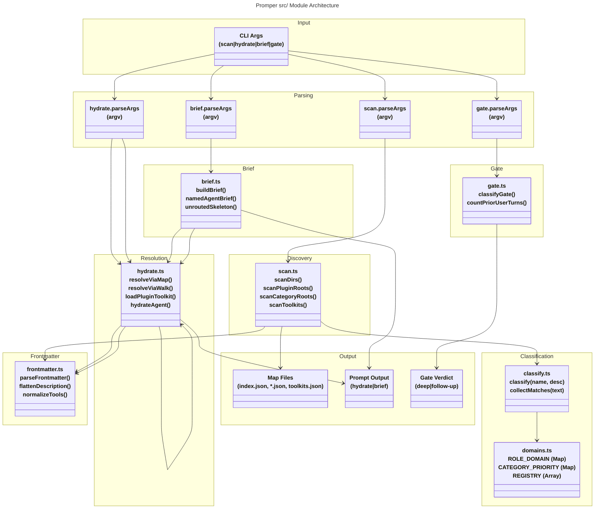

# C4 Code Level: promper/src

## Overview

- **Name**: Promper Routing & Hydration Engine
- **Description**: TypeScript deterministic routing, persona hydration, and spawn-brief generation system for Claude Code plugin agents. Implements a lean map-based agent discovery, agent persona resolution, and prompt briefing without LLM dependencies.
- **Location**: `src/`
- **Language**: TypeScript
- **Purpose**: Provides the core engine for deterministically routing user tasks to specialized agents, building spawn-ready prompts from agent personas + plugin toolkits, and classifying prompts as deep-dive vs follow-up without LLM invocation. Zero LLM cost during scan/hydrate/brief operations; operates entirely on Markdown agent files and deterministic taxonomy tables.

## Code Elements

### Modules & Entry Points

#### scan.ts
- **Description**: Deterministically builds promper's lean routing map from agent marketplaces. Scans plugin roots, category-flat repos, and flat agent directories; classifies new agents into domains; outputs index.json, domain-specific piece files, and toolkits.json.
- **Location**: src/scan.ts
- **Main Export**: `runScan(argv: string[]): Promise<void>` — CLI entry point for map scanning
  - **Parameters**: argv — command-line arguments (--dir, --plugins, --categories, --out, --check, --no-defaults)
  - **Returns**: Promise<void> — writes or checks map files
  - **Line**: 698
  - **Dependencies**: fs/promises, path, os.homedir(), classify(), frontmatter parsing

#### hydrate.ts
- **Description**: Builds spawn-ready prompts from agent personas plus plugin toolkit, without installing plugins. Resolves agent personas by name or file-stem via the lean map or fallback marketplace walk. Replaces template variables with persona, toolkit, and user task.
- **Location**: src/hydrate.ts
- **Main Export**: `runHydrate(argv: string[]): Promise<void>` — CLI entry point for prompt hydration
  - **Parameters**: argv — command-line arguments (--map, --template, --json, agent name, task)
  - **Returns**: Promise<void> — logs hydrated prompt or JSON result
  - **Line**: 269
  - **Dependencies**: fs/promises, path, os.homedir(), parseFrontmatter()

#### brief.ts
- **Description**: Deterministic, role-bearing spawn brief generator. Chains three precedence rows: real agents (no role re-injection), general-purpose + resolvable name, unrouted skeleton. Never invents a role; used by PreToolUse spawn hook and CLI.
- **Location**: src/brief.ts
- **Main Export**: `runBrief(argv: string[]): Promise<void>` — CLI entry point for brief generation
  - **Parameters**: argv — command-line arguments (--agent, --subagent-type, --map, --state, --json, task)
  - **Returns**: Promise<void> — logs brief or JSON result
  - **Line**: 251
  - **Dependencies**: child_process.spawnSync, fs/promises, path, os.homedir(), hydrate module

#### classify.ts
- **Description**: Deterministic domain classification (ported from Python reference). Implements priority chain: exact name match (ROLE_DOMAIN) → description keyword match (collectMatches) → unmapped fallback.
- **Location**: src/classify.ts
- **Main Exports**: 
  - `classify(name: string, description: string): Classification` — classify an agent name/description into a domain
    - **Line**: 60
    - **Dependencies**: domains.js (ROLE_DOMAIN, REGISTRY, CATEGORY_PRIORITY)
  - `collectMatches(text: string): Match[]` — collect all description-keyword matches from registry
    - **Line**: 36
    - **Dependencies**: domains.js (REGISTRY, CATEGORY_PRIORITY)

#### domains.ts
- **Description**: Classification tables for agent → domain routing. Deterministic data only — no I/O, no LLM.
- **Location**: src/domains.ts
- **Exports** (data tables):
  - `ROLE_DOMAIN: Readonly<Record<string, string>>` — exact agent-name → domain table (80 entries)
    - **Line**: 9
  - `CATEGORY_PRIORITY: Readonly<Record<string, number>>` — category → sort priority (12 categories)
    - **Line**: 83
  - `REGISTRY: readonly RegistryAgent[]` — trigger registry (59 agents with id/category/triggers/orchestrate)
    - **Line**: 111

#### frontmatter.ts
- **Description**: Leading `---` YAML block parsing. Extracts and normalizes frontmatter metadata from Markdown agent files.
- **Location**: src/frontmatter.ts
- **Exports**:
  - `parseFrontmatter(text: string): Frontmatter | null` — parse YAML frontmatter block from Markdown
    - **Line**: 11
    - **Dependencies**: js-yaml (external library)
  - `flattenDescription(raw: unknown): string` — collapse multiline description into single line
    - **Line**: 27
  - `normalizeTools(raw: unknown): string[]` — normalize tools field (string or YAML list)
    - **Line**: 33

#### gate.ts
- **Description**: Follow-up-vs-deep-dive classifier for UserPromptSubmit hook. Deterministic, no LLM/ML. Session opener always "deep"; later turns default "follow-up" unless strong new-task signal present.
- **Location**: src/gate.ts
- **Main Export**: `runGate(argv: string[]): Promise<void>` — CLI entry point for gate classification
  - **Parameters**: argv — command-line arguments (--transcript, --prior-turns, --json, prompt)
  - **Returns**: Promise<void> — logs verdict or JSON result
  - **Line**: 103
  - **Dependencies**: fs/promises
- **Core Functions**:
  - `classifyGate(priorUserTurns: number, prompt: string): GateVerdict` — classify prompt as "deep" or "follow-up"
    - **Line**: 18
    - **Logic**: back-reference pattern matching, word-count heuristic, prior-turn counting
  - `countPriorUserTurns(transcriptPath: string | null): Promise<number>` — count user turns in JSONL transcript
    - **Line**: 40
    - **Dependencies**: fs/promises, isUserTurn() helper

---

## Exported Functions & Core APIs

### scan.ts — Scanning & Indexing

| Function | Signature | Location | Purpose |
|----------|-----------|----------|---------|
| `runScan` | `(argv: string[]): Promise<void>` | 698 | CLI entry; orchestrates scan → merge → serialize pipeline |
| `parseArgs` | `(argv: string[]): ScanOptions` | 87 | Parse CLI flags (--dir, --plugins, --categories, --out, --check) |
| `scanDirs` | `(dirs: string[], agents?: Map<string, ScannedAgent>): Promise<Map<string, ScannedAgent>>` | 155 | Scan flat directories for *.md agent files |
| `scanPluginRoots` | `(roots: string[], agents: Map<string, ScannedAgent>): Promise<void>` | 211 | Scan wshobson-style plugin marketplaces: `<root>/plugins/<plugin>/agents/*.md` |
| `scanCategoryRoots` | `(roots: string[], agents: Map<string, ScannedAgent>): Promise<void>` | 282 | Scan category-flat repos: `<root>/<category>/*.md` |
| `scanToolkits` | `(roots: string[]): Promise<Map<string, PluginToolkitData>>` | 422 | Index each plugin's skills/ + commands/ |
| `scanSkillDirs` | `(skillsDir: string, root: string): Promise<ToolkitEntry[]>` | 358 | Scan plugin skills directory |
| `scanCommandFiles` | `(commandsDir: string, root: string): Promise<ToolkitEntry[]>` | 386 | Scan plugin commands directory |
| `loadExisting` | `(outDir: string): Promise<ExistingMap \| null>` | 456 | Load previous map from index.json + domain pieces |
| `fileStillExists` | `(file: string, roots: string[]): Promise<boolean>` | 507 | Check if piece entry's source file still exists |
| `merge` | `(scanned: Map<string, ScannedAgent>, existing: ExistingMap \| null): MergeResult` | 572 | Merge scanned agents with existing assignments; classify new agents |
| `resolveDomainAlias` | `(domain: string, existingDomains: string[]): string` | 561 | Map ported classifier domain to existing domain (backend → engineering-backend) |
| `serializeIndex` | `(buckets: Map<string, PieceEntry[]>, roots: string[]): string` | 629 | Serialize index.json with version + roots + domain lists |
| `serializePiece` | `(entries: PieceEntry[]): string` | 643 | Serialize domain piece file (domain.json) |
| `serializeToolkits` | `(toolkits: Map<string, PluginToolkitData>): string` | 443 | Serialize toolkits.json (plugin → skills/commands) |
| `defaultScanDirs` | `(): string[]` | 144 | Return default scan directories (~/.claude/agents, ./.claude/agents, ~/.codex/agents, ~/.gemini/agents) |

### hydrate.ts — Agent Resolution & Hydration

| Function | Signature | Location | Purpose |
|----------|-----------|----------|---------|
| `runHydrate` | `(argv: string[]): Promise<void>` | 269 | CLI entry; parses args, calls hydrateAgent, outputs prompt or JSON |
| `hydrateAgent` | `(agentName: string, task: string, opts?: {mapDir?, templatePath?}): Promise<HydrateResult>` | 235 | Resolve agent by name and build spawn-ready prompt from persona + toolkit + task |
| `parseArgs` | `(argv: string[]): HydrateOptions` | 45 | Parse CLI flags (--map, --template, --json) |
| `resolveViaMap` | `(mapDir: string, agent: string): Promise<ResolvedAgent \| null>` | 95 | Fast O(1) map lookup by exact name or file-stem (fastapi-pro → python-development-fastapi-pro) |
| `resolveViaWalk` | `(roots: string[], agent: string): Promise<ResolvedAgent \| null>` | 140 | Fallback: recursive walk of `<root>/plugins/<plugin>/agents/` by stem |
| `personaBody` | `(text: string): string` | 169 | Extract persona body (agent file with frontmatter intact) |
| `loadPluginToolkit` | `(resolved: ResolvedAgent): Promise<PluginToolkit>` | 212 | List plugin's skills/commands and format [TOOLKIT] block |
| `listNames` | `(dir: string): Promise<string[]>` | 173 | List all .md file stems in directory (sorted, no dots) |
| `effectiveRoots` | `(mapDir: string): Promise<string[]>` | 182 | Return roots from index.json + cwd if it's a marketplace |
| `readJson` | `(filePath: string): Promise<unknown \| null>` | 86 | Safely read and parse JSON file |

### brief.ts — Brief Generation

| Function | Signature | Location | Purpose |
|----------|-----------|----------|---------|
| `runBrief` | `(argv: string[]): Promise<void>` | 251 | CLI entry; parses args, calls buildBrief, outputs prompt or JSON |
| `buildBrief` | `(opts: BriefOptions): Promise<BriefResult>` | 197 | Route brief through precedence chain (named-agent → hydrated → unrouted) |
| `parseArgs` | `(argv: string[]): BriefOptions` | 65 | Parse CLI flags (--agent, --subagent-type, --map, --state, --json) |
| `persistedAgent` | `(statePath: string): Promise<string \| null>` | 128 | Fetch fresh, same-repo agent name from ~/.invoker/state/promper-decision.json |
| `gitRoot` | `(): string` | 121 | Return git root via `git rev-parse --show-toplevel` (fallback: cwd) |
| `namedAgentBrief` | `(task: string, toolkitBlock: string): string` | 178 | Format brief for real agents (no persona re-injection, toolkit only) |
| `unroutedSkeleton` | `(task: string): string` | 151 | Format brief skeleton for unrouted tasks (no role; scaffold for CLI use) |

### classify.ts — Domain Classification

| Function | Signature | Location | Purpose |
|----------|-----------|----------|---------|
| `classify` | `(name: string, description: string): Classification` | 60 | Classify agent name/description into domain (name → description → unmapped) |
| `collectMatches` | `(text: string): Match[]` | 36 | Collect all registry matches for lowercased text; stable-sort by category priority |
| `escapeRegExp` | `(s: string): string` | 27 | Escape regex special chars (helper for trigger matching) |

### domains.ts — Data Tables

| Export | Type | Purpose |
|--------|------|---------|
| `ROLE_DOMAIN` | `Readonly<Record<string, string>>` | Map of 80 agent names → domains (e.g., "backend-developer" → "backend") |
| `CATEGORY_PRIORITY` | `Readonly<Record<string, number>>` | Map of 12 categories → sort priority (security: 0, testing: 1, ..., implementation: 11) |
| `REGISTRY` | `readonly RegistryAgent[]` | Array of 59 agents with id/category/triggers/orchestrate for description matching |

### frontmatter.ts — Markdown Metadata

| Function | Signature | Location | Purpose |
|----------|-----------|----------|---------|
| `parseFrontmatter` | `(text: string): Frontmatter \| null` | 11 | Parse YAML frontmatter from `---...\n---\n...` block; return null if absent/invalid |
| `flattenDescription` | `(raw: unknown): string` | 27 | Collapse multiline description to single line (whitespace normalization) |
| `normalizeTools` | `(raw: unknown): string[]` | 33 | Normalize tools field from string ("a, b, c") or YAML list to string[] |

### gate.ts — Classification Gate

| Function | Signature | Location | Purpose |
|----------|-----------|----------|---------|
| `runGate` | `(argv: string[]): Promise<void>` | 103 | CLI entry; parses args, classifies prompt, outputs verdict or JSON |
| `classifyGate` | `(priorUserTurns: number, prompt: string): GateVerdict` | 18 | Classify prompt as "deep" or "follow-up" (session opener: always deep; later: follow-up unless strong new-task signal) |
| `countPriorUserTurns` | `(transcriptPath: string \| null): Promise<number>` | 40 | Count user turns in JSONL transcript (one JSON object per line) |
| `parseArgs` | `(argv: string[]): GateOptions` | 70 | Parse CLI flags (--transcript, --prior-turns, --json) |
| `isUserTurn` | `(obj: unknown): boolean` | 27 | Check if JSONL object represents a user turn (role === "user") |

---

## Interfaces & Types

### scan.ts

```typescript
interface PieceEntry {
  name: string;
  description: string;
  file: string;
  model?: string;
  [extra: string]: unknown;
}

interface ScannedAgent {
  name: string;
  description: string;
  file: string;
  model?: string;
  plugin?: string;
  classifyName: string;           // name used for domain classification
  tools: string[];
  hasDescription: boolean;
}

interface ScanOptions {
  extraDirs: string[];
  pluginRoots: string[];
  categoryRoots: string[];
  noDefaults: boolean;
  check: boolean;
  outDir: string;
}

interface ExistingMap {
  assignments: Map<string, string>;      // agent name → domain
  entries: Map<string, PieceEntry>;      // agent name → previous entry
  domains: string[];
  roots: string[];
}

interface MergeResult {
  buckets: Map<string, PieceEntry[]>;
  newAgents: { name: string; domain: string }[];
  dropped: string[];
  noDescription: string[];
  keptCount: number;
  previousDomains: string[];
}

interface ToolkitEntry {
  name: string;
  description: string;
  file: string;
}

interface PluginToolkitData {
  skills: ToolkitEntry[];
  commands: ToolkitEntry[];
}
```

### hydrate.ts

```typescript
interface HydrateOptions {
  agent: string;
  task: string;
  mapDir: string;
  templatePath: string | null;
  json: boolean;
}

export interface ResolvedAgent {
  name: string;
  absPath: string;
  plugin: string | null;
  root: string | null;                   // marketplace root if relative path
}

export interface HydrateResult {
  agent: string;
  plugin: string | null;
  source: string;
  skills: string[];
  commands: string[];
  prompt: string;
}

export interface PluginToolkit {
  skills: string[];
  commands: string[];
  block: string;                         // formatted [TOOLKIT] block
}
```

### brief.ts

```typescript
interface BriefOptions {
  task: string;
  agent: string | null;
  subagentType: string | null;
  mapDir: string;
  statePath: string;
  json: boolean;
}

interface RoutingDecision {
  verdict?: string;
  repo?: string;
  agent?: string;
  reason?: string;
  ts?: number;
}

export interface BriefResult {
  row: "named-agent" | "hydrated" | "unrouted";
  agent: string | null;
  plugin: string | null;
  source: string | null;
  prompt: string;
  noop: boolean;                         // true if brief adds nothing
  note: string | null;
}
```

### classify.ts

```typescript
export type ClassifySource = "name" | "description" | "unmapped";

export interface Classification {
  domain: string;
  source: ClassifySource;
}

interface Match {
  role: string;
  category: string;
  trigger: string;
  priority: number;
}
```

### domains.ts

```typescript
export interface RegistryAgent {
  id: string;
  category: string;
  triggers: readonly string[];
  orchestrate?: boolean;
}
```

### frontmatter.ts

```typescript
export type Frontmatter = Record<string, unknown>;
```

### gate.ts

```typescript
export type GateVerdict = "deep" | "follow-up";

interface GateOptions {
  prompt: string;
  transcriptPath: string | null;
  priorTurns: number | null;
  json: boolean;
}
```

---

## Dependencies

### Internal Dependencies (within src/)

| Module | Dependents | Relationship |
|--------|-----------|--------------|
| `frontmatter.ts` | scan.ts, hydrate.ts | parseFrontmatter, flattenDescription, normalizeTools |
| `domains.ts` | classify.ts | ROLE_DOMAIN, CATEGORY_PRIORITY, REGISTRY |
| `classify.ts` | scan.ts | classify() function |
| `hydrate.ts` | brief.ts | effectiveRoots, hydrateAgent, loadPluginToolkit, resolveViaMap, resolveViaWalk |

### External Dependencies

| Package | Used In | Purpose |
|---------|---------|---------|
| `node:fs` (fs/promises) | scan.ts, hydrate.ts, brief.ts, gate.ts | File I/O (readFile, writeFile, readdir, access) |
| `node:path` | scan.ts, hydrate.ts, brief.ts | Path resolution (join, dirname, basename, resolve, isAbsolute, relative) |
| `node:os` | scan.ts, hydrate.ts, brief.ts | Environment (homedir()) |
| `node:child_process` | brief.ts | Process spawning (spawnSync for git rev-parse) |
| `js-yaml` | frontmatter.ts | YAML parsing (yaml.load) |

---

## Module Relationships & Data Flow

### Scanning Pipeline (scan.ts)

```
CLI args → parseArgs() → [scanPluginRoots, scanCategoryRoots, scanDirs] 
→ agents Map → [loadExisting + revive stale] → merge() → [buckets, newAgents, dropped] 
→ [serializeIndex, serializePiece, serializeToolkits] → write (or check)
```

**Key flows:**
- Agent discovery: plugin roots (wins) → category roots → flat dirs → revive from existing
- Classification: new agents → classify(name, description) → resolveDomainAlias() → bucket assignment
- Merge: existing assignments authoritative; only classify new agents; drop if file vanished

### Hydration Pipeline (hydrate.ts)

```
CLI args → parseArgs() → hydrateAgent(name, task)
→ [resolveViaMap (O(1)) | resolveViaWalk (fallback)] → ResolvedAgent
→ [readFile + parseFrontmatter] → persona
→ loadPluginToolkit() → { skills, commands, block }
→ replace template vars → prompt
```

**Resolution order:**
1. Lean map (O(1) name/stem lookup across pieces + roots)
2. Fallback: walk marketplace plugins/plugin/agents/ by stem

### Brief Pipeline (brief.ts)

```
CLI args → parseArgs() → buildBrief(opts)

Row 1: subagent-type real agent?
  → resolveViaMap/Walk → loadPluginToolkit → namedAgentBrief (toolkit only)

Row 2: general-purpose + name resolvable?
  → --agent or persistedAgent() → hydrateAgent() → full hydrated brief

Row 3: nothing resolvable
  → unroutedSkeleton() → noop=true (scaffold for CLI; never rewrites live spawns)
```

### Classification Pipeline (classify.ts)

```
name, description → classify()
→ Check ROLE_DOMAIN[name] (Priority 1: exact match)
→ Check REGISTRY triggers on description (Priority 2: keyword match)
  → collectMatches(description) → stable-sort by CATEGORY_PRIORITY
  → first match's role → ROLE_DOMAIN lookup
→ Fallback: domain="unmapped"
```

### Gate Pipeline (gate.ts)

```
prompt → classifyGate(priorUserTurns, prompt)

priorUserTurns ≤ 0 → "deep" (session opener)
else:
  trimmed.match(BACK_REFERENCE) → "follow-up"
  word_count < 4 → "follow-up"
  else → "deep"
```

---

## Mermaid Diagram: Module Architecture & Data Flow



**Legend:**
- **Frontmatter**: Markdown metadata extraction (shared by scan/hydrate)
- **Classification**: Domain taxonomy (scan uses to classify new agents)
- **Discovery**: Scanning agent sources (plugin roots, category repos, flat dirs)
- **Resolution**: Map lookups + persona loading (hydration core)
- **Brief**: Role-bearing prompt composition (three precedence rows)
- **Gate**: Prompt classification (deep vs follow-up, no LLM)

---

## Key Design Patterns

### 1. Deterministic Routing (Zero LLM)
All routing decisions are deterministic, rule-based, and made without LLM invocation:
- **scan.ts**: Classification via `ROLE_DOMAIN` exact match + `REGISTRY` keyword triggers (stable-sorted by priority)
- **hydrate.ts**: Agent resolution via O(1) map lookup, fallback to structured walk
- **brief.ts**: Three precedence rows; never invents a role
- **gate.ts**: Back-reference pattern matching + word-count heuristic (no ML)

### 2. Marketplace Layout Agility
Supports three agent source layouts without code changes:
- **Plugin roots**: wshobson-style `<root>/plugins/<plugin>/agents/*.md`
- **Category roots**: flat category dirs `<root>/<category>/*.md`
- **Flat dirs**: `~/.claude/agents/`, `./.claude/agents/`, etc.

**Collision rule**: Earlier sources win; first occurrence of a name is used.

### 3. Lean Map Architecture
Instead of scanning on every spawn, builds an index once, performs O(1) lookups:
- **index.json**: domains + agent lists (roots for relative-path resolution)
- **<domain>.json**: piece files (entries for each domain)
- **toolkits.json**: plugin skills/commands (keyed by plugin, not domain)

**Fallback walk** for marketplace scenarios where map is unavailable or incomplete.

### 4. Persona + Toolkit Composition
Hydration template replaces placeholders:
- `{{AGENT_NAME}}` — agent display name (from frontmatter or file stem)
- `{{PLUGIN_SUFFIX}}` — plugin context
- `{{TARGET_ROLE_PROFILE}}` — raw agent file (frontmatter included)
- `{{TOOLKIT_BLOCK}}` — formatted skills/commands block
- `{{USER_TASK}}` — user-provided task description

### 5. Decision Persistence
**brief.ts** can persist routing decisions (`~/.invoker/state/promper-decision.json`):
- TTL: 60 minutes (matches edit gate)
- Scoped to git repo root
- Used by PreToolUse spawn hook for follow-up consistency

### 6. Graceful Degradation
Each module degrades gracefully:
- **scan.ts**: Missing dirs skipped; corrupt frontmatter ignored
- **hydrate.ts**: Map lookup fails → fallback walk; fallback walk fails → throw (caller catches)
- **brief.ts**: Row 1 toolkit not found → noop=true (brief left untouched); Row 2 name not resolvable → Row 3 (unrouted skeleton)
- **gate.ts**: Transcript missing → count=0; prior-turns flag overrides file read

---

## Data Files & Output Formats

### Map Output (scan.ts writes)

**index.json**
```json
{
  "version": 1,
  "roots": ["<absolute-path-to-plugin-root>", ...],
  "domains": {
    "backend": ["backend-developer", "django-developer", ...],
    "frontend": ["frontend-developer", "react-specialist", ...],
    ...
  }
}
```

**<domain>.json**
```json
[
  {
    "name": "backend-developer",
    "description": "Expert backend architect...",
    "file": "plugins/backend-development/agents/backend-architect.md",
    "plugin": "backend-development",
    "model": "opus"
  },
  ...
]
```

**toolkits.json**
```json
{
  "backend-development": {
    "skills": [
      { "name": "api-design", "description": "...", "file": "..." },
      ...
    ],
    "commands": [
      { "name": "backend-setup", "description": "...", "file": "..." },
      ...
    ]
  },
  ...
}
```

### Prompt Output (hydrate.ts / brief.ts outputs)

**HydrateResult (JSON)**
```json
{
  "agent": "backend-development-backend-architect",
  "plugin": "backend-development",
  "source": "/path/to/agents/backend-architect.md",
  "skills": ["api-design", "database-optimization"],
  "commands": ["setup-project"],
  "prompt": "[ADOPTED ROLE — backend-development-backend-architect (backend-development)]\n[persona content]...\n[TOOLKIT]...\n[TASK]..."
}
```

**BriefResult (JSON)**
```json
{
  "row": "hydrated",
  "agent": "backend-development-backend-architect",
  "plugin": "backend-development",
  "source": "/path/to/agents/backend-architect.md",
  "prompt": "<context>...</context>\n<instructions>...</instructions>...\n[TASK]...",
  "noop": false,
  "note": null
}
```

### Gate Verdict (gate.ts outputs)

**JSON**
```json
{
  "verdict": "deep",
  "priorTurns": 0
}
```

---

## Testing & Verification Points

### scan.ts
- Determinism: re-runs produce byte-identical output
- First-occurrence rule: plugin roots > category roots > flat dirs
- Stale cleanup: agents whose source files vanished are dropped (reported)
- Domain aliasing: ported classifier domain (backend) resolves to existing (engineering-backend)

### hydrate.ts
- O(1) map lookup: exact name or file-stem match
- Fallback walk: incomplete map still resolves agents
- Persona integrity: frontmatter preserved in persona body
- Toolkit generation: plugin, root, skills/commands all populated
- Template variable replacement: all {{PLACEHOLDER}} tags replaced

### brief.ts
- Row 1 precedence: real agents (no persona re-injection)
- Row 2 precedence: general-purpose + name resolves
- Row 3 fallback: unrouted skeleton never dilutes original prompt (noop=true)
- Decision persistence: TTL, repo scope, git root fallback
- Note isolation: advisor note never embedded in prompt (wrong audience)

### classify.ts
- Priority chain: exact name match > description triggers > unmapped
- Stable sort: category priority tie-breaking produces consistent results
- Word-boundary matching: trigger "test" doesn't match "testing"
- Registry order: array order preserved for tie-breaking

### frontmatter.ts
- Parsing: `---...\n---\n...` block extraction (both on same line rejected)
- Normalization: multiline descriptions flattened; tools split by comma or YAML list
- Graceful null return: absent/invalid frontmatter returns null, not throw

### gate.ts
- Session opener: priorUserTurns <= 0 always "deep"
- Back-reference detection: case-insensitive word-boundary regex
- Word count heuristic: < 4 words → "follow-up"
- Transcript parsing: JSONL format; corrupt lines ignored; robustness to truncation

---

## Notes

- **Zero LLM during scan/hydrate/brief/gate**: All operations deterministic, rule-based. LLM routing happens at a higher layer (PreToolUse hook or /promper command).
- **Ported from Python**: domains.py and agent_map.py logic faithfully ported to TypeScript; array/dict order preserved for deterministic tie-breaking.
- **No async bloat in classify/domains/frontmatter**: These are synchronous utilities; only I/O-bound operations (fs, net) are async.
- **Plugin toolkit live at spawn time**: toolkits.json is scan output; brief.ts loads skills/commands live at hydration to stay current with plugin state.
- **Map roots resolve relative paths**: Absolute file paths checked directly; relative paths tried against each root in order (same as hydrate.ts does).
- **Edit gate TTL matching**: brief.ts uses 60-min TTL for persisted routing decisions, matching SKILL.md Step 7.5 edit-gate window.
