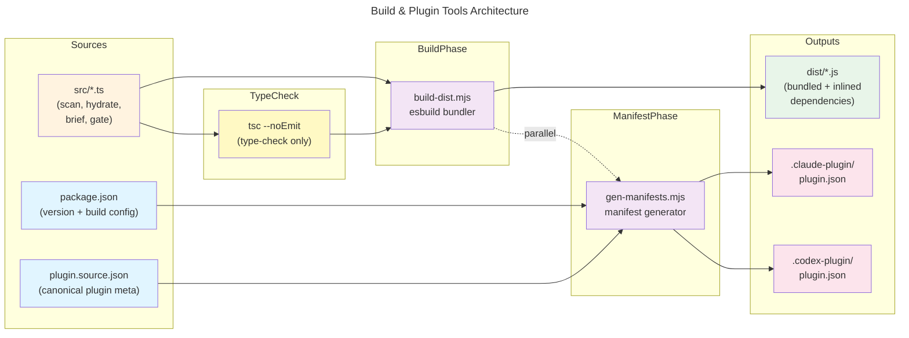

# C4 Code Level: Build & Plugin Tools

## Overview

- **Name**: promper Build & Plugin Tools
- **Description**: Node.js ESM build scripts for the Claude Code plugin: bundles TypeScript CLI entry points (scan/hydrate/brief/gate) into self-contained dist/ binaries and generates plugin manifests for .claude-plugin and .codex-plugin registries.
- **Location**: `/tools/` (relative to repository root)
- **Language**: JavaScript (ESM/Node.js 18+)
- **Purpose**: Prepare plugin for distribution to Claude Code and Codex marketplaces by (1) bundling all CLI entry points with inlined dependencies via esbuild, eliminating runtime node_modules lookups in raw git installs; (2) generating canonical plugin manifests from single source (plugin.source.json + package.json version) to prevent manifest drift.

## Code Elements

### Functions & Entry Points

#### `build-dist.mjs`

**File**: `/tools/build-dist.mjs`  
**Type**: Entry point (CLI via `node tools/build-dist.mjs`)  
**Language**: JavaScript ESM

##### `main()`
- **Signature**: `async function main(): Promise<void>`
- **Description**: Orchestrates bundling of all CLI entry points (scan, hydrate, brief, gate) from `src/*.ts` into self-contained JavaScript bundles in `dist/*.js`. Uses esbuild with `packages: "bundle"` to inline all dependencies (notably js-yaml), eliminating runtime node_modules resolution. Removes and recreates dist directory on each run for clean state.
- **Location**: `tools/build-dist.mjs:21-45`
- **Parameters**: None
- **Return**: Promise<void>
- **Dependencies**:
  - esbuild: `build()` function for bundling
  - node:fs (promises): `fs.rm()`, `fs.mkdir()` for directory setup
  - node:path: `join()` for path construction
  - node:url: `fileURLToPath()` for ESM-to-CJS path conversion
- **Side Effects**: 
  - Removes directory: `dist/` (recursive, force)
  - Creates directory: `dist/`
  - Generates files: `dist/scan.js`, `dist/hydrate.js`, `dist/brief.js`, `dist/gate.js`
  - Logs: "[name] bundled" message for each entry
- **Error Handling**: Catches errors, logs to stderr with `build-dist failed:` prefix, exits with code 1
- **Key Config**:
  - `bundle: true` — inline all dependencies
  - `platform: "node"` — Node.js runtime target
  - `target: "node18"` — ECMAScript version for Node 18+
  - `format: "esm"` — Output as ES modules
  - `packages: "bundle"` — Critical: forces esbuild to bundle external packages instead of leaving import statements
  - `sourcemap: false` — No source maps in dist
  - `logLevel: "warning"` — Suppress info-level logs

#### `gen-manifests.mjs`

**File**: `/tools/gen-manifests.mjs`  
**Type**: Entry point (CLI via `npm run build:manifests` or `node tools/gen-manifests.mjs [-- --check]`)  
**Language**: JavaScript ESM

##### `readJson(path)`
- **Signature**: `async function readJson(path: string): Promise<Record<string, unknown>>`
- **Description**: Utility to read and parse JSON file from filesystem. Used to load plugin.source.json and package.json.
- **Location**: `tools/gen-manifests.mjs:15-17`
- **Parameters**:
  - `path: string` — Absolute or relative file path
- **Return**: Promise<Record<string, unknown>> — Parsed JSON object
- **Dependencies**: node:fs (promises) `fs.readFile()`
- **Error Handling**: Throws on read or parse failure; upstream caller handles

##### `serialize(obj)`
- **Signature**: `function serialize(obj: Record<string, unknown>): string`
- **Description**: Serializes object to formatted JSON string with 2-space indentation and trailing newline. Ensures consistent formatting across manifest files.
- **Location**: `tools/gen-manifests.mjs:19-21`
- **Parameters**:
  - `obj: Record<string, unknown>` — Object to serialize
- **Return**: `string` — Formatted JSON + newline (ready for file write)
- **Format**: `JSON.stringify(obj, null, 2) + "\n"`

##### `writeIfChanged(path, content, check)`
- **Signature**: `async function writeIfChanged(path: string, content: string, check: boolean): Promise<boolean>`
- **Description**: Write file only if content differs from existing content. Returns true if file changed (or would change in --check mode). Implements efficient change detection to avoid unnecessary writes and enable CI drift detection.
- **Location**: `tools/gen-manifests.mjs:24-37`
- **Parameters**:
  - `path: string` — Absolute or relative file path
  - `content: string` — New file content
  - `check: boolean` — If true, dry run (no write); still return whether file would change
- **Return**: `boolean` — true if content differs (file changed or would change); false if identical
- **Side Effects**:
  - If check=false and content differs:
    - Creates parent directory: `dirname(path)` (recursive)
    - Writes file: `fs.writeFile(path, content, "utf8")`
- **Error Handling**: Silently catches read errors (file not exist); treats as no existing content

##### `buildClaudeManifest(source, version)`
- **Signature**: `function buildClaudeManifest(source: PluginSource, version: string): ClaudeManifest`
- **Description**: Transforms canonical plugin.source.json into .claude-plugin/plugin.json manifest. Includes full metadata: name, version, description, skills (if present), author, homepage, repository, license, keywords.
- **Location**: `tools/gen-manifests.mjs:39-52`
- **Parameters**:
  - `source: PluginSource` — Object from plugin.source.json (name, description, author, homepage, repository, license, keywords, skills)
  - `version: string` — Version from package.json (used as single source of truth)
- **Return**: `ClaudeManifest` — Object with fields: name, version, description, skills (optional), author, homepage (optional), repository (optional), license, keywords (optional)
- **Logic**:
  - Mandatory fields: name, version, description, author, license
  - Optional fields (included if present in source): skills, homepage, repository, keywords

##### `buildCodexManifest(source, version)`
- **Signature**: `function buildCodexManifest(source: PluginSource, version: string): CodexManifest`
- **Description**: Transforms canonical plugin.source.json into .codex-plugin/plugin.json manifest. Deliberately minimal, following wshobson/agents convention: excludes homepage, repository, keywords. Adds interface metadata (displayName, shortDescription, category) from source.codex. Used by Codex marketplace for listing and filtering.
- **Location**: `tools/gen-manifests.mjs:54-71`
- **Parameters**:
  - `source: PluginSource` — Object from plugin.source.json (name, description, author, license, skills, codex)
  - `version: string` — Version from package.json
- **Return**: `CodexManifest` — Object with fields: name, version, description, skills (optional), author, license, interface (displayName, shortDescription, category)
- **Logic**:
  - Mandatory fields: name, version, description, author, license, interface
  - Optional field: skills (included if present in source)
  - Interface extracted from source.codex: displayName, shortDescription, category

##### `main()`
- **Signature**: `async function main(): Promise<void>`
- **Description**: Orchestrates manifest generation. Reads plugin.source.json and package.json, generates both .claude-plugin and .codex-plugin manifests, and reports changes. Supports --check flag for CI drift detection (dry run, exits 1 if stale).
- **Location**: `tools/gen-manifests.mjs:73-104`
- **Parameters**: None
- **Return**: Promise<void>
- **Dependencies**:
  - `readJson()` — load source and package.json
  - `buildClaudeManifest()` — generate .claude-plugin manifest
  - `buildCodexManifest()` — generate .codex-plugin manifest
  - `writeIfChanged()` — write only when content differs
- **Side Effects**:
  - If not --check mode:
    - Writes: `.claude-plugin/plugin.json`
    - Writes: `.codex-plugin/plugin.json`
  - Logs to stdout (normal): "wrote: ..." or "no changes ..." (info)
  - Logs to stderr (--check with changes): "[check] stale: ..." (error)
- **Exit Codes**:
  - 0 — Success (normal or --check with up-to-date manifests)
  - 1 — Failure (error or --check with stale manifests)
- **Error Handling**: Catches errors, logs `gen-manifests failed: ${err.message}` to stderr, exits with code 1
- **Key Logic**:
  - Reads `--check` from `process.argv`
  - Loads canonical sources: `plugin.source.json`, `package.json`
  - Generates both manifests via helper functions
  - Tracks which files changed using `writeIfChanged()`
  - Reports changes or stale state

## Dependencies

### Internal Dependencies

- **plugin.source.json** (`../plugin.source.json`) — Canonical plugin metadata source:
  - Fields used by gen-manifests:
    - name, description, author, homepage, repository, license, keywords — written to both manifests
    - skills — optional, written to both manifests
    - codex.displayName, codex.shortDescription, codex.category — written to .codex-plugin only

- **package.json** (`../package.json`) — Version source:
  - Extracted field: `version` (single source of truth for both manifests)

- **TypeScript Entry Points** (bundled by build-dist.mjs):
  - `../src/scan.ts` — Deterministic routing map builder (`promper scan`)
  - `../src/hydrate.ts` — Spawn-ready prompt builder from agent persona (`promper hydrate`)
  - `../src/brief.ts` — Role-bearing spawn brief generator (`promper brief`)
  - `../src/gate.ts` — Follow-up-vs-deep-dive classifier (`promper gate`)

### External Dependencies

#### Production Dependencies
- None — tools/build-dist.mjs and tools/gen-manifests.mjs have zero runtime dependencies

#### Build/Development Dependencies (devDependencies in package.json)
- **esbuild** (`^0.28.1`) — Bundler used by build-dist.mjs
  - `build()` function for creating single self-contained JavaScript files
  - Configured for Node.js platform, ESM format, full dependency inlining
  
- **@types/node** (`^22.0.0`) — TypeScript type definitions for Node.js built-in modules
  - Used by build-dist.mjs and gen-manifests.mjs for type safety

- **@types/js-yaml** (`^4.0.9`) — TypeScript type definitions for js-yaml
  - Not directly used by tools/* but shipped in bundled dist/*.js files
  - Ensures TypeScript compilation succeeds when src/*.ts imports js-yaml

### Node.js Built-in Modules

#### build-dist.mjs
- **node:fs** (promises API) — `fs.rm()`, `fs.mkdir()` for directory operations
- **node:path** — `dirname()`, `join()` for path manipulation
- **node:url** — `fileURLToPath()` to convert ESM `import.meta.url` to filesystem path for ROOT calculation

#### gen-manifests.mjs
- **node:fs** (promises API) — `fs.readFile()`, `fs.mkdir()`, `fs.writeFile()` for JSON read/write

## Relationships

### Build Pipeline & Orchestration

The `package.json` "build" script wires these tools into a coordinated pipeline:

```json
{
  "scripts": {
    "build": "tsc --noEmit && node tools/build-dist.mjs && npm run build:manifests",
    "build:manifests": "node tools/gen-manifests.mjs"
  }
}
```

**Execution Flow**:
1. **tsc --noEmit** — TypeScript type-check (no emit). Verifies all `.ts` files compile; catches type errors early.
2. **node tools/build-dist.mjs** — Bundle phase. Compiles and bundles each `src/*.ts` entry point into single `dist/*.js` file with all dependencies inlined. Outputs ready-to-ship binaries.
3. **npm run build:manifests** → **node tools/gen-manifests.mjs** — Manifest generation. Reads plugin.source.json + package.json, generates .claude-plugin/plugin.json and .codex-plugin/plugin.json. Ensures manifests stay synchronized with canonical sources.

### Data Flow

```
plugin.source.json + package.json
         ↓
    gen-manifests.mjs
         ↓
.claude-plugin/plugin.json  ←  buildClaudeManifest()
.codex-plugin/plugin.json   ←  buildCodexManifest()


src/{scan,hydrate,brief,gate}.ts
         ↓
    build-dist.mjs (esbuild)
         ↓
dist/{scan,hydrate,brief,gate}.js  (fully bundled, zero runtime node_modules lookups)
```

### Code Diagram

The tools orchestrate two independent but coordinated transformations: CLI bundling and manifest generation.



### Dependency Matrix

| Script | Reads | Writes | Depends On | Enables |
|--------|-------|--------|-----------|---------|
| `build-dist.mjs` | `src/*.ts` | `dist/scan.js`, `dist/hydrate.js`, `dist/brief.js`, `dist/gate.js` | esbuild, @types/node, node:fs/path/url | Plugin distribution to Claude Code (dist/ bundled binaries) |
| `gen-manifests.mjs` | `plugin.source.json`, `package.json` | `.claude-plugin/plugin.json`, `.codex-plugin/plugin.json` | node:fs | Plugin marketplace registration (.claude-plugin, .codex-plugin) |
| `tsc --noEmit` | All `.ts` files + `.d.ts` | (none) | typescript, @types/* | Type safety gate before bundling |

## Implementation Notes

### Why Bundling (build-dist.mjs)

The plugin ships as a raw git checkout on Claude Code installs — `npm install` is never run. Without bundling:

1. TypeScript compile to `.js` leaves `import "js-yaml"` statements intact
2. Files run successfully in dev (node_modules present locally)
3. In production (raw clone), the `import` fails silently
4. PreToolUse hook's error handler swallows the failure by design
5. Entire spawn-brief feature becomes dead code

**Solution**: Inline all dependencies into single `.js` file → zero runtime node_modules lookups.

### Why Manifest Generation (gen-manifests.mjs)

Two plugin registries (.claude-plugin, .codex-plugin) need identical metadata except for display fields. Without unified generation:

1. Manual edits to both files cause drift
2. Version bumps must happen in two places
3. CI cannot detect staleness
4. Plugin registries fall out of sync

**Solution**: Single canonical source (plugin.source.json + package.json version) → deterministic generation of both manifests with --check support for CI drift detection.

### File Ownership & Mutation Rules

| File | Generated | Mutable | Notes |
|------|-----------|---------|-------|
| `plugin.source.json` | ❌ No (manual) | ✅ Yes | Canonical plugin metadata; edit manually, then regenerate manifests |
| `package.json` | ❌ No (manual) | ✅ Yes | Version source; bump version, then run build |
| `.claude-plugin/plugin.json` | ✅ Yes | ❌ No | Generated; never edit directly — regenerate via gen-manifests.mjs |
| `.codex-plugin/plugin.json` | ✅ Yes | ❌ No | Generated; never edit directly — regenerate via gen-manifests.mjs |
| `dist/*.js` | ✅ Yes | ❌ No | Generated; never edit directly — regenerate via build-dist.mjs |
| `src/*.ts` | ❌ No (manual) | ✅ Yes | Edit TypeScript source; rebuild via build-dist.mjs |

### Error Handling & Exit Codes

| Tool | Condition | Behavior | Exit Code |
|------|-----------|----------|-----------|
| build-dist.mjs | Any bundling error | Log error to stderr with `build-dist failed:` prefix | 1 |
| build-dist.mjs | Success | Log "bundled" message for each entry | 0 |
| gen-manifests.mjs | Any read/parse error | Log error to stderr with `gen-manifests failed:` prefix | 1 |
| gen-manifests.mjs | Success (normal mode) | Log files written or "no changes" | 0 |
| gen-manifests.mjs | Success (--check mode, up-to-date) | Log "[check] manifests up to date" | 0 |
| gen-manifests.mjs | Stale (--check mode, drift detected) | Log "[check] stale: <files> — run ..." to stderr | 1 |

### TypeScript & ESM Compatibility

- Both scripts are `.mjs` (explicit ESM)
- Both use `import.meta.url` for ESM-to-CJS path resolution
- Both target Node.js 18+ (ships in package.json: `"engines": {"node": ">=18"}`)
- build-dist.mjs uses esbuild with `target: "node18"` and `format: "esm"`
- gen-manifests.mjs pure JavaScript, no transpilation needed

## Version & Ownership

- **Repository**: https://github.com/justjammin/promper
- **Author**: Jamin Echols
- **License**: Apache-2.0
- **Package Version**: 0.4.1 (from package.json; used as single source for all manifests)
- **Node.js Requirement**: >=18

## Related Documentation

- **C4 Component Level**: [c4-code-hydrate.md, c4-code-brief.md, c4-code-scan.md, c4-code-gate.md] — Documentation for the TypeScript entry points bundled by build-dist.mjs
- **Plugin Manifest Specs**: [.claude-plugin/plugin.json, .codex-plugin/plugin.json] — Output artifacts generated by gen-manifests.mjs
- **Source Manifest**: [plugin.source.json] — Canonical plugin metadata
