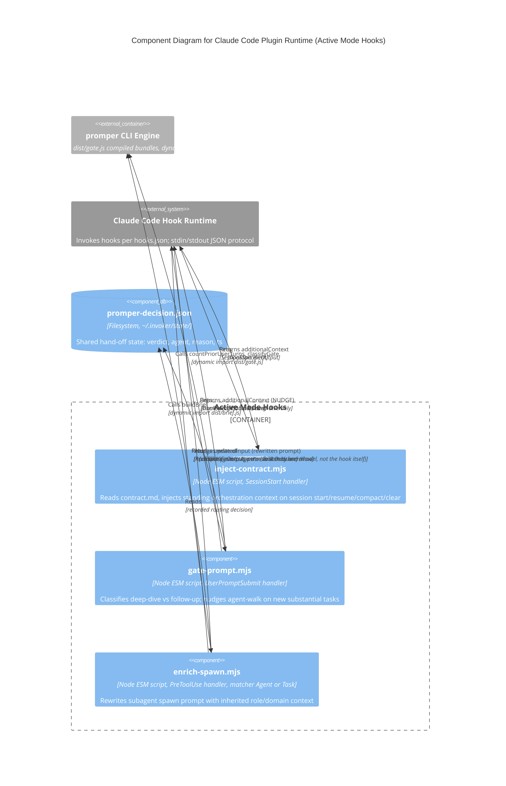

# C4 Component Level: Active Mode Hooks

## Overview

- **Name**: Active Mode Hooks
- **Description**: Five Claude Code lifecycle hook scripts (`hooks/*.mjs`) that make promper's agent-routing and role-inheritance behavior fire automatically — on session start, on every user prompt, on every subagent spawn, on every repo-file edit, and at session end — instead of requiring the user to manually invoke `/promper`.
- **Type**: Claude Code plugin hook layer
- **Technology**: Node.js ESM (v18+), zero npm runtime dependencies by design (Node built-ins only: `node:fs`, `node:os`, `node:path`, `node:url`, `process`)

## Purpose

This component is promper's "active mode": the mechanism that makes the agent-walk happen without the user remembering to type `/promper`. Four Claude Code hook events — `SessionStart`, `UserPromptSubmit`, `PreToolUse` (two matchers), `SessionEnd` — are wired to deterministic Node scripts that inject orchestration context, nudge routing decisions, rewrite subagent spawn prompts with inherited role/persona context, gate repo edits behind a fresh routing decision, and re-arm that gate at session end.

It also makes the plugin self-contained. The `SessionStart` hook (`inject-contract.mjs`) injects `hooks/contract.md` as standing session context, replacing orchestration rules a user would otherwise have to hand-maintain in their personal `~/.claude/CLAUDE.md`. Installing the plugin is sufficient — no manual CLAUDE.md edits required to get promper's routing discipline.

All five hooks are deterministic (zero LLM calls). They are thin orchestration glue: hook lifecycle plumbing (stdin/stdout JSON, env checks, fail-safe passthrough) on one side, and — for the gate and spawn hooks — calls into the compiled `promper CLI Engine` bundles (`dist/brief.js`, `dist/gate.js`) via runtime `import()` rather than subprocess spawn. `contract-gate.mjs` and `clear-decision.mjs` are self-contained (Node built-ins only, no `dist/` import).

## Software Features

- **SessionStart contract injection**: On session start/resume/compact/clear, reads `hooks/contract.md` and injects it as `additionalContext`, embedding promper's routing/execution-decision/edit-gate rules into every session without the user maintaining a personal CLAUDE.md copy.
- **UserPromptSubmit deep-dive/follow-up gate**: On every user message, classifies the prompt as a new substantial task ("deep") vs. a continuation ("follow-up") using `dist/gate.js`. On "deep", injects a NUDGE instructing the user/model to run `/promper` agent-walk and record the routing decision; on "follow-up", stays silent — never nags on every turn.
- **PreToolUse role-bearing spawn-brief rewrite**: On every `Agent`/`Task` tool invocation, intercepts the spawn prompt and rewrites it via `dist/brief.js` (`buildBrief()`) to embed the previously-recorded role/domain context, so the subagent inherits a specialist persona instead of a bare task string.
- **PreToolUse contract gate**: On every `Edit`/`Write`/`MultiEdit`/`NotebookEdit` targeting a file inside the active repo, denies the edit until a fresh routing decision exists at `~/.invoker/state/promper-decision.json` (any verdict, same repo root, 60-min TTL). The deny reason re-delivers the contract summary and the exact JSON to record. Out-of-repo writes (including the state file itself) are never gated; every unexpected condition fails open.
- **SessionEnd gate re-arm**: Clears this repo's routing decision when the session ends, so the next session's first repo edit re-runs the agent-walk. Repo-scoped — never wipes another repo's live decision.
- **`PROMPER_ACTIVE` off-switch**: Setting `PROMPER_ACTIVE=0` disables all five hooks uniformly — every hook passes through with zero mutation, restoring stock Claude Code behavior.
- **`PROMPER_DEBUG_LOG` tracing**: Setting `PROMPER_DEBUG_LOG=<path>` makes `enrich-spawn.mjs` append one JSON line per hook decision (pass-through reason, rewrite outcome, brief failure, etc.) for auditing which spawns were engineered and why. Zero cost when unset.

## Code Elements

This component contains the following code-level elements, documented in full at [c4-code-hooks.md](./c4-code-hooks.md):

- `hooks/inject-contract.mjs` — SessionStart hook; reads and injects `contract.md`
- `hooks/gate-prompt.mjs` — UserPromptSubmit hook; classifies deep-dive vs. follow-up, injects NUDGE + re-injects `contract.md` on deep, no state write itself (state is written by the user/model per the NUDGE instructions)
- `hooks/enrich-spawn.mjs` — PreToolUse hook (matcher `"Agent|Task"`); reads recorded routing decision, rewrites spawn prompt via `buildBrief()`
- `hooks/contract-gate.mjs` — PreToolUse hook (matcher `"Edit|Write|MultiEdit|NotebookEdit"`); denies repo-file edits until a fresh routing decision exists
- `hooks/clear-decision.mjs` — SessionEnd hook; clears this repo's routing decision so the gate re-arms next session
- `hooks/hooks.json` — hook registration manifest (event → command mapping, per-entry matchers)
- `hooks/contract.md` — the standing orchestration contract text injected by `inject-contract.mjs` (and re-injected by `gate-prompt.mjs` on deep prompts)

## Interfaces

Each hook is a Claude Code lifecycle event handler: a Node process invoked by the Claude Code runtime, reading one JSON object from stdin and writing one JSON object to stdout, then exiting 0. These are the component's only interfaces — there are no HTTP/RPC endpoints; the "protocol" is Claude Code's hook stdin/stdout contract.

### SessionStart Interface (`inject-contract.mjs`)

- **Protocol**: Claude Code hook stdin/stdout JSON (event: `SessionStart`, no matcher — fires unconditionally on start/resume/compact/clear)
- **Reads (stdin)**:
  ```json
  { "hook_event_name": "SessionStart" }
  ```
- **Emits (stdout, `hookSpecificOutput`)**:
  ```json
  {
    "hookSpecificOutput": {
      "hookEventName": "SessionStart",
      "additionalContext": "<contract.md contents>"
    }
  }
  ```
- **Degrade path**: wrong event name, or `contract.md` missing/unreadable → passthrough, no output mutation.

### UserPromptSubmit Interface (`gate-prompt.mjs`)

- **Protocol**: Claude Code hook stdin/stdout JSON (event: `UserPromptSubmit`, no matcher — fires on every user message)
- **Reads (stdin)**:
  ```json
  {
    "hook_event_name": "UserPromptSubmit",
    "prompt": "string",
    "transcript_path": "string | null"
  }
  ```
- **Emits (stdout, `hookSpecificOutput`)** — only on "deep" classification:
  ```json
  {
    "hookSpecificOutput": {
      "hookEventName": "UserPromptSubmit",
      "additionalContext": "<NUDGE text: run /promper agent-walk, route via ~/.invoker/map/, inherit persona, record decision>"
    }
  }
  ```
- **Degrade path**: wrong event name, or classification is "follow-up" → passthrough, no output.
- **Note**: this hook does not itself write the state file. It nudges the user/model to run `/promper`, which (per the manual-mode CLI flow, documented in the CLI Engine component) is what actually records `~/.invoker/state/promper-decision.json`.

### PreToolUse Interface (`enrich-spawn.mjs`)

- **Protocol**: Claude Code hook stdin/stdout JSON (event: `PreToolUse`, matcher: `"Agent|Task"` — fires only when `tool_name` matches)
- **Reads (stdin)**:
  ```json
  {
    "hook_event_name": "PreToolUse",
    "tool_name": "Agent" | "Task",
    "tool_input": {
      "subagent_type": "string | undefined",
      "prompt": "string | undefined",
      "description": "string | undefined"
    }
  }
  ```
- **Emits (stdout, `hookSpecificOutput`)**:
  ```json
  {
    "hookSpecificOutput": {
      "hookEventName": "PreToolUse",
      "permissionDecision": "allow",
      "updatedInput": { "...toolInput": "...", "prompt": "<rewritten prompt>" }
    }
  }
  ```
- **Degrade path**: `PROMPER_ACTIVE=0`, wrong event/matcher, agent in `READ_ONLY_SPAWNS` ("Explore", "Plan"), prompt already carries the `<instructions>` marker, `dist/brief.js` missing, or `buildBrief()` throws → passthrough with the original, unrewritten `tool_input`.

## Dependencies

### Components Used

- **promper CLI Engine** (documented elsewhere — `dist/brief.js`, `dist/gate.js` compiled bundles): loaded at runtime via dynamic `import(join(HOOK_DIR, "..", "dist", ...))`, never via subprocess.
  - `enrich-spawn.mjs` calls `buildBrief({ task, agent, subagentType, mapDir, statePath, json })` → `{ noop, note, prompt, row, agent }`.
  - `gate-prompt.mjs` calls `countPriorUserTurns(transcriptPath)` → `Promise<number>`, then `classifyGate(priorTurns, prompt)` → `"deep" | "follow-up"`.
  - This is a build-time/runtime split, not a network call: if `dist/*.js` isn't built, both hooks degrade to passthrough rather than failing the tool call.

### External Systems

- **Claude Code hook runtime**: the host process that invokes each `.mjs` script per `hooks.json`, feeds it stdin JSON, and consumes its stdout JSON. This is the only "caller" of this component; there is no other entry point.
- **Shared state file** (`~/.invoker/state/promper-decision.json`, on the local filesystem): the hand-off bridge between `gate-prompt.mjs` and `enrich-spawn.mjs`. Written when the user/model acts on the NUDGE (records `verdict`/`agent`/`reason`/`ts`); read by `enrich-spawn.mjs` (via `buildBrief()`'s `statePath` option) to recover which role/persona a subagent spawn should inherit. The two hooks never call each other directly — they are decoupled entirely through this file.

## Component Diagram



**Hand-off note**: `gate-prompt.mjs` and `enrich-spawn.mjs` have no direct coupling. `gate-prompt.mjs` fires first (on prompt submit) and only *nudges* the recording of a decision; the actual write to `~/.invoker/state/promper-decision.json` happens out-of-band when the user (or the model in plan mode) runs `/promper` agent-walk. `enrich-spawn.mjs` fires later (on the subsequent Agent/Task tool call) and reads whatever is in that file at that moment. The filesystem, not a function call, is the integration point — this is what lets the component tolerate `dist/*.js` builds being stale/missing on one side without breaking the other.
