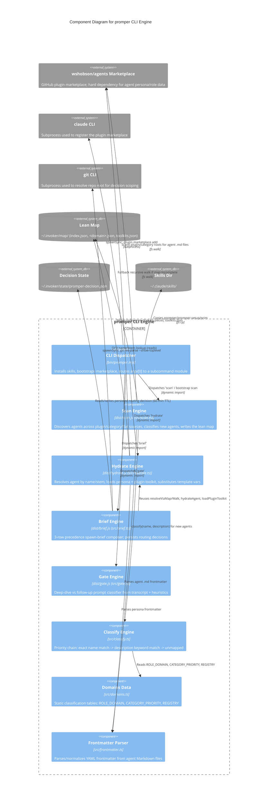

# C4 Component Level: promper CLI Engine

## Overview

- **Name**: promper CLI Engine
- **Description**: Deterministic (zero-LLM) routing, persona-hydration, and spawn-brief engine for Claude Code plugin agents, exposed as a Node.js CLI binary and consumed as a library by the hook layer.
- **Type**: CLI application + library
- **Technology**: Node.js ESM (bin/promper.mjs), TypeScript compiled via esbuild to dist/*.js (src/scan.ts, hydrate.ts, brief.ts, gate.ts, classify.ts, domains.ts, frontmatter.ts), js-yaml for frontmatter parsing

## Purpose

promper CLI Engine is the deterministic core of the promper system: it discovers agent personas across marketplaces, routes tasks to the right agent, hydrates spawn-ready prompts, and classifies prompts as deep-dive vs follow-up — all without a single LLM call. It solves the problem of agent discovery and routing being either hand-maintained (brittle, stale) or LLM-mediated (slow, costly, non-deterministic) by building a lean, versioned index once (`scan`) and then performing O(1) lookups against it (`hydrate`, `brief`, `gate`).

Its role in the system is foundational: it is the CLI surface a human runs directly (`npx @ninjamin/promper scan|hydrate|brief|gate`), and it is also the same engine the hook layer (PreToolUse/UserPromptSubmit hooks — documented as a separate component) calls into for automatic routing during a live session. No other component in the system depends on it being anything other than what it is — it has no upstream dependencies within promper; everything else is built on top of it.

## Software Features

- **Install / bootstrap** (`npx @ninjamin/promper`): copies the `promper`, `promper-setup`, and `prim` skill directories into `~/.claude/skills` (recursive, force-overwrite) and registers `wshobson/agents` as a Claude Code plugin marketplace, treating it as a hard dependency for role data. Retryable standalone via `promper bootstrap`.
- **scan** (`promper scan`): builds the lean routing map by scanning three agent-source layouts — wshobson-style plugin roots (`<root>/plugins/<plugin>/agents/*.md`), category-flat repos (`<root>/<category>/*.md`), and flat directories (`~/.claude/agents/`, etc.) — classifying newly discovered agents into domains and writing `index.json`, per-domain piece files, and `toolkits.json` (plugin skills/commands index) to `~/.invoker/map/`. Deterministic first-occurrence collision rule (plugin roots > category roots > flat dirs); existing assignments are authoritative on re-scan; stale entries (source file vanished) are dropped and reported.
- **hydrate** (`promper hydrate <agent> "<task>"`): resolves an agent by exact name or file-stem via O(1) lean-map lookup (fallback: recursive marketplace walk), loads its persona (frontmatter-intact) and plugin toolkit (skills + commands), and substitutes `{{AGENT_NAME}}`, `{{PLUGIN_SUFFIX}}`, `{{TARGET_ROLE_PROFILE}}`, `{{TOOLKIT_BLOCK}}`, `{{USER_TASK}}` into a spawn-ready prompt.
- **brief** (`promper brief "<task>"`): role-bearing spawn brief generator with a strict 3-row precedence chain — (1) real/named agent → toolkit-only brief, no persona re-injection; (2) general-purpose + resolvable agent name → full hydrated brief; (3) nothing resolvable → unrouted skeleton (`noop: true`, never rewrites a live spawn). Persists routing decisions to `~/.invoker/state/promper-decision.json` (60-minute TTL, scoped to git repo root) for follow-up consistency.
- **gate** (`promper gate "<prompt>"`): deterministic deep-dive-vs-follow-up classifier for the UserPromptSubmit hook. Session opener is always "deep"; later turns default to "follow-up" unless a strong new-task signal (word count ≥ 4, no back-reference pattern) is present. No ML/LLM — regex + heuristics + prior-turn counting from the JSONL transcript.

## Code Elements

This component contains the following code-level elements:

- [c4-code-bin.md](./c4-code-bin.md) — `bin/promper.mjs`: the CLI entry point/dispatcher (install flow, marketplace bootstrap, subcommand routing to compiled `dist/*.js` modules).
- [c4-code-src.md](./c4-code-src.md) — `src/`: the TypeScript engine — `scan.ts`, `hydrate.ts`, `brief.ts`, `gate.ts` (the four subcommand implementations) plus shared internals `classify.ts` (domain classification), `domains.ts` (classification data tables), and `frontmatter.ts` (Markdown YAML frontmatter parsing).

## Interfaces

### CLI Subcommand Interface

- **Protocol**: Command-line invocation (argv), synchronous process exit codes, optional `--json` machine-readable output on stdout
- **Description**: The sole public interface of this component. A human (or the hook layer, via subprocess) invokes `promper <subcommand> [flags]`; each subcommand dynamically imports its compiled module from `dist/` and calls its exported `run*` function with `argv.slice(1)`.
- **Operations**:
  - `promper` (no subcommand) — install: `Promise<void>` — creates `~/.claude/skills`, copies `promper`/`promper-setup`/`prim` skill directories, then runs bootstrap. Exits 1 on `mkdir`/`cp` failure.
  - `promper bootstrap` — bootstrap: `Promise<boolean>` — ensures `wshobson/agents` marketplace is registered (`claude plugin marketplace add` subprocess if cache missing) and runs an initial scan against the marketplace cache. Exits 1 if marketplace cannot be added.
  - `promper scan [--dir <path>] [--plugins <root>] [--categories <root>] [--out <dir>] [--check] [--no-defaults] [--legacy]` — `runScan(argv): Promise<void>` — builds/updates the lean routing map. `--check` validates without writing; `--no-defaults` skips the built-in default scan directories; `--legacy` additionally emits `~/.invoker/agent-map.json`.
  - `promper hydrate <agent> "<task>" [--map <dir>] [--template <path>] [--json]` — `runHydrate(argv): Promise<void>` — resolves `<agent>` and prints (or emits JSON for) a spawn-ready hydrated prompt.
  - `promper brief "<task>" [--agent <name>] [--subagent-type <name>] [--map <dir>] [--state <path>] [--json]` — `runBrief(argv): Promise<void>` — prints (or emits JSON for) the precedence-chain spawn brief (`row`, `agent`, `plugin`, `source`, `prompt`, `noop`, `note`).
  - `promper gate "<prompt>" [--transcript <path>] [--prior-turns <n>] [--json]` — `runGate(argv): Promise<void>` — prints (or emits JSON for) the verdict (`deep` | `follow-up`) and `priorTurns` count.

## Dependencies

### Components Used

- None. This is the base/foundation layer of the promper system — it has no dependency on any other promper component. The hook layer (a separate, higher-level component, documented elsewhere) depends on this one, not the reverse.

### External Systems

- **Filesystem — `~/.invoker/map/`**: the lean routing map this component owns end-to-end. `scan` writes `index.json` (version, roots, domain→agent-name lists), per-domain piece files, and `toolkits.json` (plugin → skills/commands); `hydrate` and `brief` read it for O(1) agent resolution (falling back to a marketplace walk if the map is missing/incomplete).
- **Filesystem — `~/.invoker/state/promper-decision.json`**: written and read by `brief` to persist routing decisions (60-minute TTL, git-repo-root scoped) so follow-up turns stay consistent with the original spawn decision.
- **Filesystem — `~/.claude/skills/`**: install target for the `promper`, `promper-setup`, and `prim` skill directories (recursive copy, force overwrite).
- **wshobson/agents marketplace (GitHub, via Claude Code plugin marketplace)** — hard dependency for role/persona data. Registered via a `claude plugin marketplace add wshobson/agents` subprocess during bootstrap; `scan` reads agent `.md` files from its plugin cache; installation is designed to continue (with a warning) if the marketplace cannot be added, but role discovery has no other source.
- **`claude` CLI (subprocess)** — invoked via `spawnSync` in `bootstrap()` to register the marketplace.
- **`git` CLI (subprocess)** — invoked via `spawnSync("git rev-parse --show-toplevel")` in `brief.ts` to scope persisted routing decisions to the repo root (falls back to `cwd` if not in a git repo).
- **js-yaml (npm package)** — used only inside `frontmatter.ts` to parse the YAML frontmatter block of agent Markdown files.

## Component Diagram

**Notes on the diagram** (verified against the source dependency table in c4-code-src.md):
- `frontmatter.ts` is shared by `scan.ts` and `hydrate.ts` only.
- `classify.ts` → `domains.ts` is a scan-only chain; `hydrate`/`brief`/`gate` never touch classification.
- `brief.ts` depends on `hydrate.ts` directly; it reaches `frontmatter.ts` only transitively through it.
- `gate.ts` has **no internal-module dependencies** — it uses only `node:fs/promises` and is fully self-contained.
