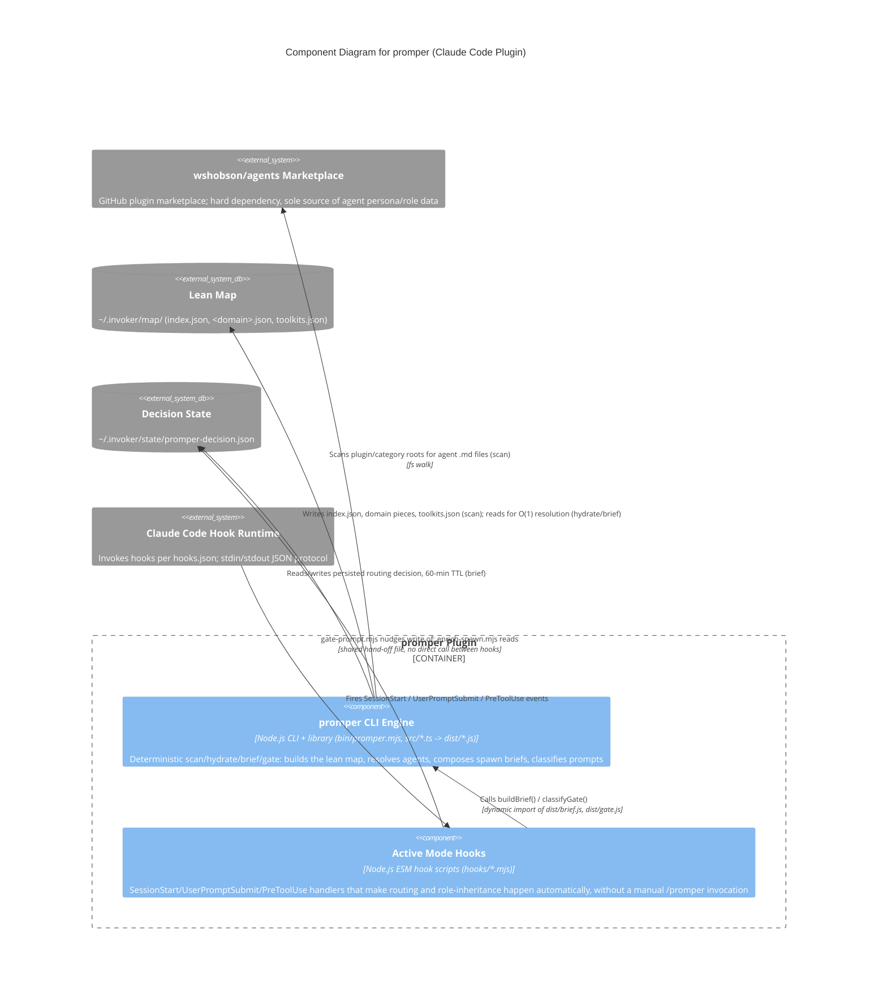

# C4 Component Level: System Overview

## System

**promper** — a Claude Code plugin that routes tasks to specialist agent personas and hydrates spawn-ready prompts, deterministically (zero LLM calls) and automatically (via hook lifecycle events), backed by a lean routing map built once from the `wshobson/agents` marketplace.

## System Components

### promper CLI Engine

- **Name**: promper CLI Engine
- **Description**: Deterministic (zero-LLM) routing, persona-hydration, and spawn-brief engine, exposed both as a standalone CLI (`npx @ninjamin/promper scan|hydrate|brief|gate`) and as the library the hook layer imports. Owns the lean routing map (`~/.invoker/map/`) and the persisted-decision state file (`~/.invoker/state/promper-decision.json`) end-to-end. No dependency on any other promper component — this is the foundation layer.
- **Documentation**: [c4-component-cli-engine.md](./c4-component-cli-engine.md)

### Active Mode Hooks

- **Name**: Active Mode Hooks
- **Description**: Three Claude Code lifecycle hook scripts (`hooks/inject-contract.mjs` SessionStart, `hooks/gate-prompt.mjs` UserPromptSubmit, `hooks/enrich-spawn.mjs` PreToolUse) that make promper's routing and role-inheritance behavior fire automatically during a live session. Calls into the CLI Engine's compiled bundles (`dist/brief.js`, `dist/gate.js`) directly via dynamic `import()`, not subprocess — a build-time/runtime split that degrades to passthrough if `dist/` isn't built.
- **Documentation**: [c4-component-active-mode-hooks.md](./c4-component-active-mode-hooks.md)

## Build Infrastructure (not a runtime component)

- **tools/gen-manifests.mjs, tools/build-dist.mjs**: Node.js ESM build scripts that run only at build/publish time, never at runtime. `build-dist.mjs` bundles the four TypeScript CLI entry points (`src/scan.ts`, `hydrate.ts`, `brief.ts`, `gate.ts`) via esbuild into the self-contained `dist/*.js` files that both the CLI dispatcher (`bin/promper.mjs`) and the Active Mode Hooks dynamically import; `gen-manifests.mjs` generates the `.claude-plugin`/`.codex-plugin` manifests from a single source of truth. This layer produces artifacts consumed by the two runtime components above — it is not itself invoked during a session and is therefore documented as build tooling, not a peer component. See [c4-code-tools.md](./c4-code-tools.md).

## Component Relationships

Both runtime components live in the same deployment unit (the promper Claude Code plugin) but are invoked through different entry points: the CLI Engine via `argv`/subprocess (human or manual `/promper` invocation), the Active Mode Hooks via Claude Code's hook lifecycle (automatic). The hooks depend one-way on the CLI Engine's compiled output; there is no reverse dependency. Both components share two filesystem-based external dependencies for state, and both ultimately depend on the `wshobson/agents` marketplace as the only source of agent persona/role data (the CLI Engine reads it directly during `scan`; the hooks only ever reach it indirectly, through the lean map the CLI Engine built from it).

**Notes on the diagram**:
- The two components never call each other's process directly and are not linked by subprocess — the Active Mode Hooks reach the CLI Engine only through `dynamic import()` of its compiled `dist/brief.js` and `dist/gate.js` bundles (produced by the build infrastructure, see below), and the two hooks (`gate-prompt.mjs`, `enrich-spawn.mjs`) are decoupled from each other entirely through the shared `promper-decision.json` state file rather than a function call.
- `~/.invoker/map/` (the lean map) is written only by the CLI Engine's `scan` and read only by the CLI Engine's `hydrate`/`brief` — the Active Mode Hooks never touch it directly; any map-derived context they surface arrives pre-baked inside the `buildBrief()` result.
- The `wshobson/agents` marketplace is a dependency of the CLI Engine only. The Active Mode Hooks have no direct edge to it — they depend on the CLI Engine having already scanned it into the lean map.
