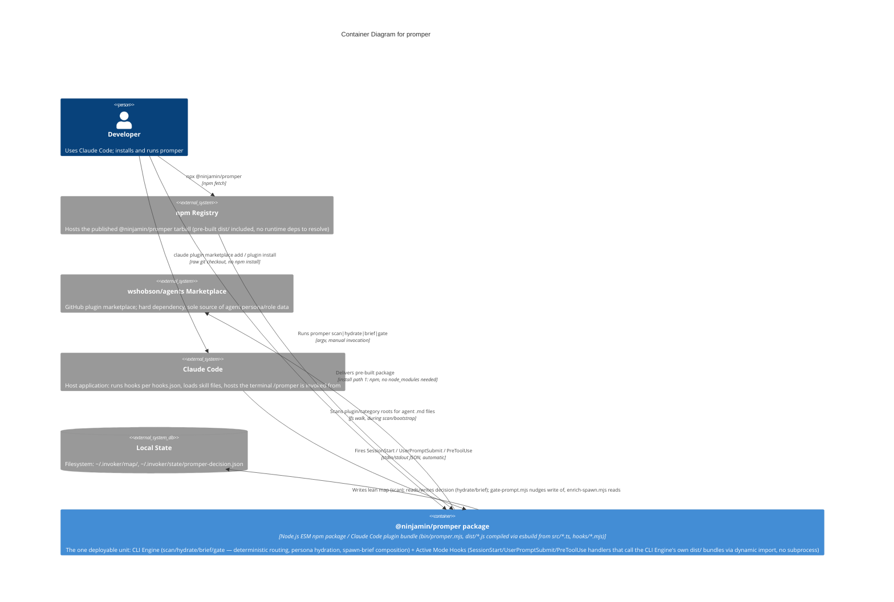

# C4 Container Level: promper Deployment

## Containers

### @ninjamin/promper package

- **Name**: @ninjamin/promper package
- **Description**: The single deployable unit of the promper system. One published npm package that doubles as a Claude Code plugin bundle (and a Codex plugin bundle) — the CLI Engine and the Active Mode Hooks documented at the component level are both just files inside this one artifact, invoked through two different entry points by two different consumers, not two separate deployments.
- **Type**: npm package / Claude Code (and Codex) plugin bundle — not a networked service, not a container image
- **Technology**: Node.js ESM, `>=18` (per `package.json` `engines`); TypeScript (`src/*.ts`) compiled and bundled via esbuild into self-contained `dist/*.js`; hook layer is Node built-ins only. `package.json` declares **no runtime `dependencies` at all** — only `devDependencies` (`js-yaml`, `esbuild`, `typescript`, `@types/*`), which are build-time-only and are never installed for a consumer (via `npx` or otherwise). `js-yaml`, the one library the code actually imports at runtime, is inlined straight into `dist/*.js` by esbuild (`packages: "bundle"`) at build time, and `dist/` is committed to git (not gitignored) and included in the npm `files` list — so both install paths ship the same pre-built, dependency-free bundle; neither ever performs a live `node_modules` resolution for it
- **Deployment**: npm registry (`npx @ninjamin/promper`) and the Claude Code plugin marketplace (raw git checkout via `.claude-plugin/marketplace.json`) — no Docker image, no Kubernetes manifest, no cloud service; see [Infrastructure](#infrastructure) for why

## Purpose

promper is a prompt-engineering toolkit for Claude Code: it routes tasks to specialist agent personas and hydrates spawn-ready prompts, deterministically (zero LLM calls), backed by a lean routing map built once from the `wshobson/agents` marketplace. Everything the system does — discovery, routing, persona hydration, spawn-brief composition, deep-dive/follow-up classification — lives inside this one package.

The package reaches a user's machine exactly two ways, and both ways run the same files:

1. **`npx @ninjamin/promper`** (npm path) — npm fetches the published tarball (whose `files` list includes the already-built `dist/`, `bin/`, `hooks/`, `skills/`) and runs `bin/promper.mjs`. Since `package.json` has no `dependencies` field, npm installs nothing else at all for this consumer — it is running straight off the pre-built bundle, same as path 2. This is the path a human uses to install (copies the `promper`/`prim`/`promper-setup` skills into `~/.claude/skills`, registers the `wshobson/agents` marketplace) and to manually invoke `scan`/`hydrate`/`brief`/`gate`.
2. **Claude Code plugin marketplace install** (`claude plugin marketplace add` against `.claude-plugin/marketplace.json`, then plugin install) — Claude Code does a **raw git checkout** of the repo into `~/.claude/plugins/marketplaces/<name>/plugins/promper/`. Critically, this path **never runs `npm install`**. There is no `node_modules` at all in this deployment — not even the build-time `devDependencies`. This is why `dist/*.js` must be pre-bundled via esbuild (`tools/build-dist.mjs`, `packages: "bundle"`) with all dependencies (notably `js-yaml`) inlined, and why `dist/` is committed to git rather than gitignored: a bare `import "js-yaml"` in a raw git checkout would throw `ERR_MODULE_NOT_FOUND` at hook-fire time, since there is no `node_modules/js-yaml` to resolve against, ever, on this path. This was a real bug found and fixed this session (see [c4-code-tools.md](./c4-code-tools.md)): the fix is exclusively at the container/build level (self-contained bundles committed/shipped alongside source), not at the component logic level — the CLI Engine and hooks components did not change, only what gets shipped inside the one container did.

In both paths, the plugin manifests (`.claude-plugin/plugin.json` for Claude Code, `.codex-plugin/plugin.json` for Codex — an alternate harness consuming the same package) are generated from one source of truth, `plugin.source.json`, via `tools/gen-manifests.mjs`, so the two harness-facing manifests never drift from each other or from `package.json`'s version.

The package's role in the system: it is both the CLI surface a human runs directly and the automatic hook layer that fires during a live Claude Code session — same files, same version, same install, two invocation surfaces.

## Components

This container deploys the following components (see [c4-component.md](./c4-component.md) for the full component-level breakdown):

- **promper CLI Engine** — deterministic scan/hydrate/brief/gate engine, exposed as `bin/promper.mjs` (CLI dispatcher) plus the compiled `dist/scan.js`, `dist/hydrate.js`, `dist/brief.js`, `dist/gate.js` bundles. Owns the lean routing map and the persisted-decision state file end-to-end. No dependency on any other promper component.
  - Documentation: [c4-component-cli-engine.md](./c4-component-cli-engine.md)
- **Active Mode Hooks** — five Claude Code lifecycle hook scripts (`hooks/inject-contract.mjs`, `hooks/gate-prompt.mjs`, `hooks/enrich-spawn.mjs`, `hooks/contract-gate.mjs`, `hooks/clear-decision.mjs`) that make routing, role-inheritance, and contract enforcement fire automatically during a session — the first three calling into the CLI Engine's compiled `dist/brief.js` / `dist/gate.js` via dynamic `import()` (never subprocess), the gate/clear pair self-contained on Node built-ins.
  - Documentation: [c4-component-active-mode-hooks.md](./c4-component-active-mode-hooks.md)

Both components ship inside the same package version, in the same install, at the same path on disk — they are not independently versioned or independently deployable.

## Interfaces

This container has **no network API** — no HTTP, no gRPC, no message queue. Its public surface is entirely local: a CLI binary, three OS-process lifecycle hook contracts (stdin/stdout JSON), and three Claude Code skill files. Each is documented below in place of an API Specifications / OpenAPI section, which is intentionally omitted (see [API Specifications](#api-specifications) note at the end of this section).

### `promper` CLI Binary

- **Protocol**: Command-line invocation (argv), synchronous process exit codes, optional `--json` machine-readable stdout
- **Description**: The package's `bin` entry (`package.json` → `"bin": { "promper": "bin/promper.mjs" }`). Installed onto `PATH` by npm (`npx @ninjamin/promper ...` or, once installed, bare `promper ...`); also invoked manually by a user inside a Claude Code session via the `/promper` skill.
- **Subcommands**: `promper` (install), `promper bootstrap`, `promper scan`, `promper hydrate <agent> "<task>"`, `promper brief "<task>"`, `promper gate "<prompt>"` — full flag reference in [c4-component-cli-engine.md](./c4-component-cli-engine.md#interfaces).

### Claude Code Hook Event Contracts

Three lifecycle event handlers registered in `hooks/hooks.json`, each a Node process reading one JSON object from stdin and writing one JSON object to stdout:

- **`SessionStart`** (`hooks/inject-contract.mjs`, no matcher — fires on start/resume/compact/clear): injects `hooks/contract.md` as `additionalContext`.
- **`UserPromptSubmit`** (`hooks/gate-prompt.mjs`, no matcher — fires on every user message): classifies "deep" vs "follow-up"; on "deep", emits a NUDGE to run `/promper` agent-walk.
- **`PreToolUse`** (`hooks/enrich-spawn.mjs`, matcher `"Agent|Task"`): rewrites the spawn prompt via `buildBrief()` to embed the recorded routing decision, so subagents inherit a role.
- **`PreToolUse`** (`hooks/contract-gate.mjs`, matcher `"Edit|Write|MultiEdit|NotebookEdit"`): denies edits to repo files until a fresh routing decision exists in the state file (any verdict, same repo, 60-min TTL); out-of-repo writes are never gated; fails open.
- **`SessionEnd`** (`hooks/clear-decision.mjs`, no matcher): clears this repo's routing decision so the contract gate re-arms for the next session.

Full request/response JSON shapes and degrade paths: [c4-component-active-mode-hooks.md](./c4-component-active-mode-hooks.md#interfaces).

### Skill Files (Claude Code slash commands)

Three skill directories, copied into `~/.claude/skills/` at install time (`bin/promper.mjs` install flow) and also present under `skills/` inside the plugin bundle itself:

- **`/promper`** — engineers a role-grounded prompt from a rough request (decompose → route via CLI Engine → hydrate persona → craft prompt).
- **`/prim`** — audits/certifies agent files against the prompt-engineering standard.
- **`/promper:setup`** — builds the domain→agent lean map once (wraps `promper scan`).

### API Specifications — not applicable

This container is explicitly **not** given an OpenAPI/Swagger specification. There is no HTTP surface, no request/response schema served over a network, and no client that calls this container remotely — every interface above is either a local process invocation (argv), a local stdin/stdout JSON handshake with the Claude Code host process on the same machine, or a skill file loaded directly by the host. Generating an OpenAPI document for any of these would misrepresent the system as a networked service, which it is not. The stdin/stdout JSON shapes for the five hooks are documented verbatim above (linked) instead, since that is the actual, complete interface contract.

## Dependencies

### Containers Used

- None. This is the only container in the system — there is nothing else to depend on internally.

### External Systems

- **`wshobson/agents` Claude Code plugin marketplace (GitHub)** — hard dependency, the sole source of agent persona/role data. Registered via a `claude plugin marketplace add wshobson/agents` subprocess during `bootstrap`; the CLI Engine's `scan` reads agent `.md` files from its plugin cache. Nothing in the package can substitute for this — if it can't be added, installation continues with a warning but role discovery has no other source.
- **Local filesystem state**:
  - `~/.invoker/map/` (`index.json`, per-domain piece files, `toolkits.json`) — the lean routing map, written by `scan`, read by `hydrate`/`brief`. This is the container's only persistent "database," and it lives on the same machine as the container itself — never a remote store.
  - `~/.invoker/state/promper-decision.json` — the hand-off file between `gate-prompt.mjs`'s nudge and `enrich-spawn.mjs`'s read, and between manual `promper brief` runs and later Agent/Task spawns; also what `contract-gate.mjs` checks before allowing repo edits and `clear-decision.mjs` removes at session end. 60-minute TTL, scoped to git repo root.
  - `~/.claude/skills/` — install target for the three skill directories.
- **Claude Code host application** — the only process that ever invokes the Active Mode Hooks (per `hooks.json`) or loads the skill files; also the process a human is inside of when running `promper` manually via `/promper`. Without a running Claude Code session, the hook interfaces are simply never invoked (they are not a standalone service listening for anything).
- **`claude` CLI (subprocess)** — invoked by `bin/promper.mjs`'s `bootstrap()` to register the `wshobson/agents` marketplace.
- **`git` CLI (subprocess)** — invoked by the compiled `brief.js` to resolve the repo root that scopes the persisted decision file.
- **npm registry** — distribution channel for install path 1 only; irrelevant to install path 2 (raw git checkout never touches the registry after the initial repo clone/marketplace add).

## Infrastructure

- **No Dockerfile, no Kubernetes manifest, no docker-compose, no Terraform** — and this is deliberate, not an omission. promper is not a networked service with a request/response lifecycle to containerize; it is a filesystem-installed CLI binary plus a set of lifecycle hook scripts that a *different* application (Claude Code, or npm) invokes locally on the user's own machine. There is no server process to keep running, no port to expose, no ingress to configure.
- **Deployment configs that do exist, and what they replace**:
  - `.claude-plugin/plugin.json` + `.claude-plugin/marketplace.json` — Claude Code's plugin registration manifest (this *is* the "deployment manifest" for install path 2).
  - `.codex-plugin/plugin.json` — the equivalent manifest for the Codex harness, same package.
  - `plugin.source.json` + `tools/gen-manifests.mjs` — single source of truth the two manifests above are generated from, preventing drift between them (see [c4-code-tools.md](./c4-code-tools.md)).
  - `package.json` (`bin`, `files`, `engines`) — the npm-side manifest for install path 1.
  - `tools/build-dist.mjs` — the step that makes the git-checkout install path (2) work at all without `npm install`, by pre-bundling all runtime dependencies into `dist/*.js`.
- **Scaling**: not a meaningful concept here. The container runs once per user, per machine, per Claude Code session (or once per manual CLI invocation) — there is no concurrent-request load to handle, no horizontal/vertical scaling axis, no shared multi-tenant instance. Each hook invocation is a short-lived Node process spawned and torn down by the Claude Code host per lifecycle event; "capacity" is bounded by nothing other than the local machine running one Node process at a time per event.
- **Resources**: whatever a short-lived Node.js CLI process needs — negligible CPU/memory, no persistent open ports, no background daemon. The only durable state is the small JSON files under `~/.invoker/`.

## Container Diagram

**Notes on the diagram**:
- There is exactly **one** `Container` node because there is exactly one deployable unit. The CLI Engine / Active Mode Hooks split is a component-level distinction (see the component diagrams in [c4-component.md](./c4-component.md)) — at the container level they are the same package version, same install, same files on disk, never versioned or shipped independently of each other, so they are not drawn as separate containers here.
- The two `Rel(user, ...)` edges at the top show the two independent install/invocation paths described in [Purpose](#purpose): npm-mediated versus plugin-marketplace-mediated (raw git checkout). Both land on the identical pre-built `dist/` bundle — neither path ever performs a live `node_modules` resolution for runtime code.
- `npmRegistry` only participates in install path 1; a plugin-marketplace install never touches it after the initial repository clone.
- `mapState` is drawn external (`SystemDb_Ext`), consistent with how the component-level diagrams treat `~/.invoker/map/` and `~/.invoker/state/promper-decision.json` — it is filesystem state the container reads/writes, not something bundled inside the package artifact itself.
