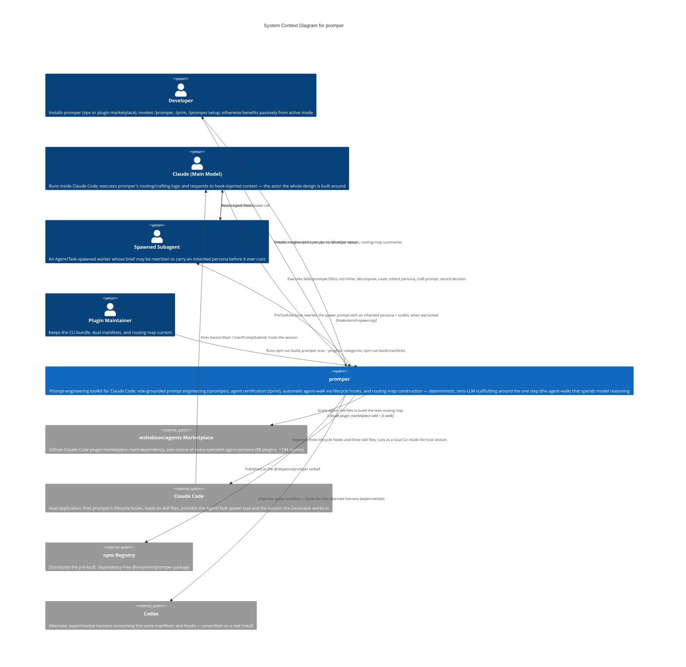

# C4 Context Level: System Context

## System Overview

### Short Description

promper is a prompt-engineering toolkit for Claude Code that routes a task to the specialist agent it would naturally go to, borrows that agent's own persona as the prompt's role, and hands back an engineered prompt — with the map-building, classification, and brief-assembly scaffolding around that routing step running deterministically, at zero LLM cost.

### Long Description

Most "prompt engineering" tools ask you to invent a role: "You are an expert copywriter…", "You are a senior backend engineer…". promper's core bet is that this step is unnecessary and usually worse than the alternative, because **the role already exists**. If a developer has installed specialist agents (from a marketplace, or hand-authored locally), each one's system prompt already *is* a tuned persona for its domain. The best `<role>` for a prompt isn't a guess — it's the persona of whichever specialist agent that task would route to anyway.

promper acts on that bet in two ways:

- **`/promper`** takes a rough human intent, decomposes it, routes it to the matching specialist agent (checking the in-session agent list first, then a lean routing map it builds once from an agent marketplace), inherits that agent's actual persona text as the `<role>`, and crafts the rest of the prompt (context, instructions, examples, constraints, output format) against an 11-principle standard. Nothing spawns by default — it hands back a plan and copy-paste-ready prompt(s); only `--run` executes.
- **`/prim`** is the quality gate on the role source itself: it scores every candidate agent 0–100 against the same standard, flags weak or ambiguous personas, and certifies ("seals") the ones that pass — so promper isn't inheriting a role from a badly-written agent without warning the developer first.

A third, less visible layer makes this happen **without anyone remembering to type a command**: three Claude Code lifecycle hooks ship with the plugin and quietly run the same routing/inheritance logic in the background of an ordinary session — injecting standing rules at session start, nudging the agent-walk on a new substantial task, and rewriting a spawned subagent's brief to carry the routed persona, all through deterministic (non-LLM) code plus one hand-off file on disk.

The whole system is a single, dependency-free npm package (no server, no database, no network API) that installs either via `npx` or via the Claude Code plugin marketplace, and depends on exactly one external role source to have anything to route to at all: the `wshobson/agents` Claude Code plugin marketplace.

## Personas

### Developer (human user)

- **Type**: Human User
- **Description**: A developer using Claude Code who installs promper (via `npx @ninjamin/promper` or the Claude Code plugin marketplace) and either invokes it deliberately — `/promper`, `/prim`, `/promper:setup` — or simply benefits from it running automatically in the background of a normal session via the active-mode hooks. Most of the time this persona does nothing extra at all; the value shows up as better-routed prompts and better-behaved subagent spawns without a manual step.
- **Goals**: Get a well-engineered, role-grounded prompt without hand-writing a persona; trust that the agents promper routes to are actually good prompts (not silently weak ones); keep the routing map current as installed agents change; optionally turn the automatic behavior off (`PROMPER_ACTIVE=0`) without losing the manual commands.
- **Key Features Used**: `/promper` (role-grounded prompt engineering), `/prim` (agent certification), the automatic active-mode hooks (passively), `/promper:setup` / `promper scan` (routing-map construction).

### Claude (the main model, running inside Claude Code)

- **Type**: Programmatic User — not an external system, but the actor the entire design exists for
- **Description**: This is the model itself, running live inside a Claude Code session. It is the one that actually reads `skills/promper/SKILL.md` and executes its routing/crafting logic inline when a developer types `/promper`; the one whose context gets the `SessionStart` hook's injected orchestration contract (`hooks/contract.md`); and the one that receives the `UserPromptSubmit` hook's silent-or-nudging signal on every new message. Everything promper does at "make" time — decompose, route, inherit a persona, craft a prompt, decide where a node executes — is work this persona performs, not work some external service does on its behalf.
- **Goals**: Never invent a `<role>` when a real specialist agent exists to inherit one from; keep the routing/decomposition/crafting steps token-lean and deterministic where possible (zero LLM calls for classification and brief assembly — only the agent-walk itself spends model reasoning); decide per-node whether work runs inline or gets spawned out; record that decision so downstream hooks and future turns can reuse it instead of re-deciding.
- **Key Features Used**: `/promper`'s Steps 1–8 (parse → route → inherit persona → craft → self-critique → execute-decision → output), the `SessionStart`-injected contract, the `UserPromptSubmit` gate's nudge, and writing/reading `~/.invoker/state/promper-decision.json`.

### Spawned subagent

- **Type**: Programmatic User (downstream actor)
- **Description**: A worker spawned via Claude Code's `Agent`/`Task` tool, either because `/promper --run` chose to spawn a node or because the main model spawned a `general-purpose` subagent on its own during an ordinary session. Before that spawn call reaches the host, promper's `PreToolUse` hook (`hooks/enrich-spawn.mjs`) intercepts it and may rewrite the prompt to carry a full inherited persona and plugin toolkit ahead of the task text — or leave it completely untouched if there's nothing of value to add. What this subagent receives measurably changes how it behaves: a documented A/B comparison (`docs/spawn-ab-test-cost-and-output.md`) showed the persona-injected run opening with an explicit domain-confirmation line, adopting that specialist's own report structure, and reaching for more specific, named techniques — versus a plain, competent-but-generic answer with no persona at all.
- **Goals**: Complete the assigned task; when a role was inherited, actually behave like that specialist (its working style, its structure, its go-to techniques) rather than as a generic assistant.
- **Key Features Used**: The `PreToolUse` spawn-brief rewrite (rows 1 and 2 of `promper brief`'s precedence — named-agent-with-toolkit, or general-purpose-with-fresh-routing-match); receives (or doesn't receive) the persona text and toolkit line that `enrich-spawn.mjs` injects.

### Plugin maintainer (secondary persona)

- **Type**: Human User
- **Description**: The person who keeps promper itself — the tool, not just its routing data — current: rebuilding the compiled bundle, regenerating the two harness manifests from one source of truth, and re-scanning agent sources into the routing map after upstream changes.
- **Goals**: Keep the self-contained `dist/*.js` bundle (built by `tools/build-dist.mjs` via esbuild) in sync with `src/*.ts` so a raw git-checkout plugin install never breaks from a missing `node_modules`; keep `.claude-plugin/plugin.json` and `.codex-plugin/plugin.json` from drifting apart by generating both from `plugin.source.json`; keep `~/.invoker/map/` current as new agent sources (marketplace updates, category-flat agent repos) appear.
- **Key Features Used**: `npm run build` (compiles `src/*.ts` → `dist/*.js`), `npm run build:manifests` (`tools/gen-manifests.mjs`), `promper scan --plugins <root>` / `promper scan --categories <root>` (routing-map construction against arbitrary agent sources, not just the default one).

## System Features

### Role-grounded prompt engineering (`/promper`)

- **Description**: Turns a rough intent into an engineered, XML-structured (or CO-STAR) prompt whose `<role>` is inherited — never invented — from the specialist agent the task routes to. Presents a plan first; spawns nothing unless `--run` is passed, in which case each node's execution placement (inline vs. subagent) is decided individually.
- **Users**: Developer (invokes it), Claude/main model (executes it end to end).
- **User Journey**: See [Manual `/promper` journey](#manual-promper-journey).

### Agent certification (`/prim`)

- **Description**: Audits agent system prompts against the same 11-principle standard `/promper` crafts against, scores each 0–100 with P0/P1/P2 findings, and records a pass/fail "seal of approval" (score ≥ 80, zero P0) to a ledger. Can optionally rewrite failing agents (`--fix`), gated by per-file confirmation and careful handling of plugin-provided vs. user-authored files.
- **Users**: Developer (invokes it, approves the evaluation set, confirms any fixes); indirectly, Claude/main model (promper's Step 5 reads the resulting ledger and warns before inheriting a role from an uncertified or weak agent).
- **User Journey**: See [`/prim` certification journey](#prim-certification-journey).

### Automatic agent-walk (active-mode hooks)

- **Description**: Three Claude Code lifecycle hooks that make routing and role-inheritance happen without a manual `/promper` invocation: `SessionStart` injects the standing orchestration contract, `UserPromptSubmit` silently classifies each message and nudges the agent-walk only on a genuinely new task, and `PreToolUse` rewrites a subagent's spawn prompt with an inherited persona when one is on record. All three are deterministic (regex/JSON/filesystem checks, no model call) except the agent-walk they trigger, which runs in the main model exactly as `/promper` would.
- **Users**: Claude/main model (executes the hooks' triggered behavior), Developer (benefits passively, can disable via `PROMPER_ACTIVE=0`), Spawned subagent (receives the rewritten — or untouched — brief).
- **User Journey**: See [Fully-automatic active-mode journey](#fully-automatic-active-mode-journey).

### Routing-map construction (`/promper:setup`, `promper scan`)

- **Description**: Builds and maintains the lean routing map (`~/.invoker/map/`) that both the manual and automatic paths walk during role discovery — one small `index.json` plus one file per domain, so a routing pass never has to read a large file. Deterministic scanning and classification (name table → description keywords); only genuinely unclassifiable agents need a human/model judgment call to place.
- **Users**: Developer / Plugin maintainer (run it), Claude/main model (consumes its output during every routing pass).
- **User Journey**: See [Install/bootstrap journey](#installbootstrap-journey).

### Dual-platform manifest generation

- **Description**: `.claude-plugin/plugin.json` (Claude Code) and `.codex-plugin/plugin.json` (Codex) are both generated from one canonical source, `plugin.source.json`, via `tools/gen-manifests.mjs` — so the two harness-facing manifests, and the package's own `package.json` version, never drift apart.
- **Users**: Plugin maintainer.
- **User Journey**: See [Plugin-maintainer manifest journey](#plugin-maintainer-manifest-journey).

## User Journeys

### Manual `/promper` journey

Persona: Developer + Claude (main model). Zero spawns unless `--run` is passed.

1. **Developer** types `/promper <rough intent>` in a live Claude Code session.
2. **Claude** runs `skills/promper/SKILL.md` inline: parses the intent, checks whether it's really a request to engineer a prompt (vs. a question expecting an answer), and asks at most 2–3 batched clarifying questions only if something critical is missing.
3. **Claude** decomposes the intent into a small `bead_graph` (almost always a single node).
4. **Claude** routes the node to a specialist agent — checking the in-session agent list first (0 tokens), then the lean map at `~/.invoker/map/` (~700 tokens), then a legacy map as a last resort, never reading any map file whole.
5. **Claude** inherits that agent's actual persona (its `.md` body, or its description as a fallback) as the `<role>` — and checks the `prim` seal ledger, warning the developer if the source agent is uncertified or scored weak.
6. **Claude** crafts the rest of the prompt inline against the 11-principle checklist (`<context>`, `<instructions>`, `<examples>`, `<constraints>`, `<output_format>`), spawning the Prompt Engineer agent only if `--deep` was passed.
7. **Claude** self-critiques the draft against the scoring rubric and silently patches gaps.
8. **Claude** presents the engineered prompt(s), a one-line routing header (`routed → <agent> (via <source>) → role = 
`), and any open slots the developer must fill. **Nothing has spawned.**
9. *(Only with `--run`)*: **Claude** decides, per node, whether it runs inline or as a spawned subagent, records that decision to `~/.invoker/state/promper-decision.json`, and executes.

### Fully-automatic active-mode journey

Persona: Claude (main model, executing), Developer (passive), Spawned subagent (downstream recipient).

1. **`SessionStart`** fires once (on startup, resume, compact, or clear) — `inject-contract.mjs` injects `hooks/contract.md` into **Claude's** context as standing orchestration rules.
2. **Developer** types an ordinary prompt — no `/promper` invocation.
3. **`UserPromptSubmit`** fires — `gate-prompt.mjs` runs `promper gate` (a deterministic classifier, no LLM call): a session opener or a genuinely new substantial task is classified "deep"; a short follow-up or back-reference is classified "follow-up".
4. **If "deep"**: the hook injects a nudge telling **Claude** to run the agent-walk. Claude runs `skills/promper/SKILL.md` inline exactly as in the manual journey (decompose → route → inherit persona) and writes `{"verdict", "repo", "agent", "reason", "ts"}` to `~/.invoker/state/promper-decision.json`.
   **If "follow-up"**: the hook stays completely silent — nothing happens.
5. At some point, **Claude** issues an `Agent`/`Task` tool call to spawn a subagent for some piece of work.
6. **`PreToolUse`** (matcher `Agent|Task`) intercepts that call first — `enrich-spawn.mjs` runs `promper brief` (deterministic): a named agent with a resolvable toolkit → row 1; an unnamed `general-purpose` spawn with a fresh, repo-matched decision on file → row 2; neither → row 3.
7. **Row 1 or row 2**: the hook rewrites the subagent's prompt to embed the inherited persona (and, where applicable, the plugin's toolkit) ahead of the original task text. **Row 3**: the original prompt passes through completely untouched — never wrapped in empty boilerplate.
8. **The spawned subagent** receives that prompt, runs, and returns its result to Claude. A measured comparison (`docs/spawn-ab-test-cost-and-output.md`) shows the persona-carrying version opening with an explicit domain-confirmation line, structuring its answer the way that named specialist would, and reaching for more specific named techniques — versus a generically structured, still-competent answer with no persona at all.

### `/prim` certification journey

Persona: Developer + Claude (main model).

1. **Developer** runs `/prim`, `/prim --all`, or `/prim <names or globs>`.
2. **Claude** discovers agent files from `~/.claude/agents/`, `./.claude/agents/`, `./.agents/`, and the agents already recorded in promper's lean map — tagging each as user-authored or plugin-provided.
3. **Claude** displays the discovered set and asks the **Developer** which to evaluate. This gate is mandatory — an agent is never scored without explicit approval.
4. **Claude** scores each approved agent 0–100 against the rubric in `reference/pe-principles.md`, producing P0/P1/P2 findings with a concrete fix for each.
5. **Claude** computes the seal (score ≥ 80 and zero P0) and records it to `~/.claude/agents/.prim-seal.json`, keyed by name + source path + a content hash — the ledger only, never a stamp written into the agent file itself.
6. **Claude** presents a per-agent report plus a roster summary ("N sealed · M need work").
7. *(Optional `--fix`)*: only for agents that both failed and were approved in step 3. User-authored files are edited in place; plugin-provided files are never silently edited (a `/plugin update` would revert them) — instead **Claude** offers a corrected override copy in `~/.claude/agents/` and says so. Every change is shown as a diff and requires explicit per-file confirmation before writing, then the fixed agent is re-scored.
8. Downstream, whenever `/promper`'s Step 5 is about to inherit a role from an agent this ledger marks uncertified or weak, it warns the **Developer** before doing so.

### Install/bootstrap journey

Persona: Developer, with the npm registry / Claude Code host / `wshobson/agents` marketplace as external participants.

1. **Developer** runs `npx @ninjamin/promper` (or installs promper through the Claude Code plugin marketplace — `claude plugin marketplace add` + plugin install, a raw git checkout instead).
2. The installer copies the `promper`, `prim`, and `promper-setup` skill directories into `~/.claude/skills/`.
3. The installer bootstraps the role source: if the `wshobson/agents` marketplace cache is absent, it runs `claude plugin marketplace add wshobson/agents` as a subprocess.
4. It then runs `promper scan --plugins ~/.claude/plugins/marketplaces/claude-code-workflows --no-defaults` — a deterministic, zero-LLM scan — to build `~/.invoker/map/` (an `index.json`, one file per domain, and `toolkits.json`) from that marketplace's ~194 agents across 88 plugins.
5. **Developer** restarts Claude Code; `/promper` and `/prim` now resolve and have a real map to route against.
6. This bootstrap is idempotent and can be re-run any time (`npx @ninjamin/promper bootstrap`, also what `/promper:setup` runs); `promper scan` alone can add supplementary local or category-flat agent sources without touching the marketplace registration.

### Plugin-maintainer manifest journey

Persona: Plugin maintainer.

1. **Maintainer** edits the single canonical metadata file, `plugin.source.json` (name, description, version, etc.).
2. **Maintainer** runs `npm run build:manifests` — `tools/gen-manifests.mjs` regenerates both `.claude-plugin/plugin.json` (Claude Code) and `.codex-plugin/plugin.json` (Codex) from that one source, so the two harness-facing manifests and `package.json`'s version never drift apart.
3. **Maintainer** runs `npm run build` — `tools/build-dist.mjs` bundles `src/scan.ts`, `hydrate.ts`, `brief.ts`, and `gate.ts` via esbuild into self-contained `dist/*.js` files, with every runtime dependency (notably `js-yaml`) inlined — this is what lets a raw git-checkout plugin install work at all without ever running `npm install`.
4. **Maintainer** commits the rebuilt `dist/` alongside the source change (it is checked into git, not gitignored) so both install paths — `npx` and the plugin marketplace — ship the identical pre-built bundle.
5. **Maintainer** re-runs `promper scan --plugins <root>` or `promper scan --categories <root>` against updated or additional agent sources (an updated `wshobson/agents` checkout, or an alternate category-flat repo) to keep `~/.invoker/map/` current — idempotently; existing domain assignments are never moved.

## External Systems and Dependencies

### `wshobson/agents` Claude Code plugin marketplace

- **Type**: External software system (GitHub-hosted Claude Code plugin marketplace)
- **Description**: A marketplace of 88 plugins bundling roughly 194 specialist agents, each with its own `agents/`, `skills/`, and `commands/`. This is the actual source of every specialist persona promper can inherit a role from.
- **Integration Type**: Registered via a `claude plugin marketplace add wshobson/agents` subprocess call during bootstrap; consumed by `promper scan --plugins <root>` as a filesystem walk over the resulting local plugin cache; consumed again at role-inheritance time when a routed agent's `.md` body is read directly from that cache.
- **Purpose**: Hard dependency — there is no substitute role source. If this marketplace can't be added, installation continues with a warning, but role discovery has nothing else to fall back to beyond a generic expert role.

### Claude Code (host application)

- **Type**: External software system (the host application promper's plugin runs inside)
- **Description**: The only process that ever fires promper's three lifecycle hooks (per `hooks/hooks.json`) or loads its skill files; also the interactive session a developer is inside of when running `promper` manually.
- **Integration Type**: Local lifecycle hook contracts (stdin/stdout JSON per event: `SessionStart`, `UserPromptSubmit`, `PreToolUse`), local skill-file loading (`/promper`, `/prim`, `/promper:setup`), and the `Agent`/`Task` tool that `enrich-spawn.mjs` intercepts.
- **Purpose**: Without a running Claude Code session, none of promper's hook interfaces are ever invoked — it is not a standalone service listening for anything on its own.

### npm registry

- **Type**: External software system (package distribution channel)
- **Description**: Hosts the published `@ninjamin/promper` tarball, including its already-built `dist/`, `bin/`, `hooks/`, and `skills/` — the package declares no runtime `dependencies`, so nothing further is installed for this path either.
- **Integration Type**: Package fetch/install — `npx @ninjamin/promper` pulls the tarball; this is the only path that touches the registry at all (a plugin-marketplace install never does, after its initial clone).
- **Purpose**: Distribution channel for install path 1 (the `npx` path); irrelevant to the plugin-marketplace install path.

### Codex

- **Type**: External software system (alternate agent harness)
- **Description**: A second, experimental target harness that consumes the same package — the same manifests (`.codex-plugin/plugin.json`, generated from the same `plugin.source.json`) and the same hook scripts as Claude Code.
- **Integration Type**: Plugin manifest + hook-file consumption, structurally identical to the Claude Code integration.
- **Purpose**: Positions promper for a second frontier harness without maintaining a second codebase. Explicitly **unverified**: the files ship, but hook *behavior* has not yet been confirmed against a real Codex install.

## System Context Diagram

**Notes on the diagram**:
- `mainModel` and `subagent` are drawn as `Person` nodes rather than `System_Ext`, deliberately: neither is an external dependency promper calls out to — they are actors *inside* the same live Claude Code session that promper's own logic runs as, or spawns from. The main model is, in fact, the actor executing most of promper's own behavior (Steps 1–8 of `/promper`, the hook-triggered agent-walk); documenting it as an external system would misrepresent who does the work.
- There is exactly one `System` box — promper — because, as the container-level documentation notes, this is a single deployable unit (one npm package) with no internal network boundary to show at this level.
- `claudeCode` appears twice in relationship terms: it is the thing the Developer installs *through* (one of two install paths) and the thing that *fires* promper's hooks during an ordinary session — both are shown as edges into/around it rather than as separate systems, since it is one host application either way.

## Related Documentation

- [Container Documentation](./c4-container.md) — the single deployable unit (one npm package, two invocation surfaces), its interfaces (CLI binary, hook contracts, skill files), and its external/filesystem dependencies.
- [Component Documentation](./c4-component.md) — the two runtime components inside that container (the promper CLI Engine and the Active Mode Hooks), their relationship, and the build tooling that produces the artifacts they run from.
- [How promper moves](./plugin-flow.md) — a hand-written, sequence-diagrammed walkthrough of the manual and active-mode runtime paths that the journeys above are grounded in.
- [Spawn A/B test: cost and output](./spawn-ab-test-cost-and-output.md) — the measured comparison of a persona-injected vs. plain subagent spawn cited in the Spawned Subagent persona and the active-mode journey above.
- [Prompt-Engineering Principles & Skeleton](../reference/pe-principles.md) — the single source of truth both `/promper` and `/prim` score and craft against.
