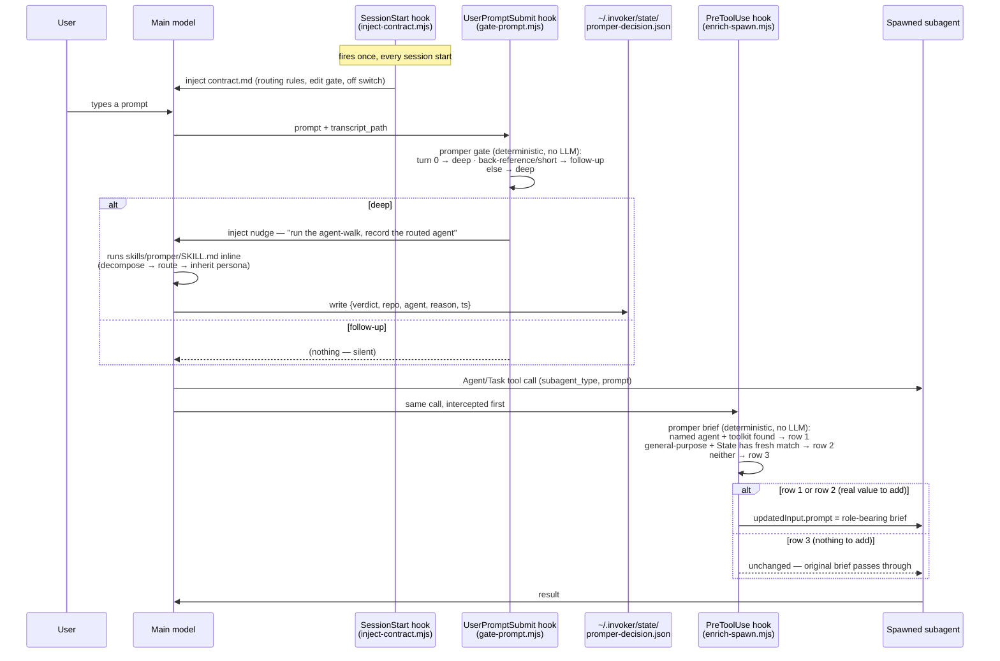

# How promper moves — current state

Two independent paths through the plugin: **manual** (you type `/promper`) and **active**
(three hooks that fire on their own). This doc is the plain-English map of both, as they
actually behave right now — not the aspirational design, the verified one.

## Manual path

```
you: /promper <rough intent>
  → skills/promper/SKILL.md runs, entirely inline, in the main model
  → decompose intent → route via ~/.invoker/map/ → inherit persona → craft prompt
  → present prompt(s) + routing header. Zero spawns.
  → (only on --run) spawn per the Step 7.5 inline-vs-subagent decision
```

Nothing here is a hook. This is the same as it's always been — a skill the model follows when
you invoke it.

## Active path — three hooks, one state file



## What "deterministic, no LLM" means here, concretely

Both `gate-prompt.mjs` and `enrich-spawn.mjs` call plain TypeScript functions
(`classifyGate`/`countPriorUserTurns` and `buildBrief`) — regex checks, JSON reads, file-system
lookups. Neither hook can call a model even if it wanted to (hooks are shell commands, not LLM
calls) — the *only* LLM-requiring step is the agent-walk itself (routing, persona selection),
which runs in the main model when the gate nudges it, or when you run `/promper` by hand. The
hooks are the deterministic scaffolding around that one LLM step, not a replacement for it.

## The hand-off, and why it can silently no-op

`~/.invoker/state/promper-decision.json` is the only channel between the gate (which triggers
routing) and the spawn hook (which inherits the result). Two things make this brittle by design,
not by accident:

- **60-minute TTL.** A stale decision is treated as absent, not as a wrong-but-present answer.
- **Exact repo match** (`git rev-parse --show-toplevel`, both sides). Spawn a subagent from a
  different repo than the one that wrote the decision → row 3, not a wrong persona.

Both failure modes degrade to row 3 (skeleton, or — since the noop fix — a complete no-op),
never to a wrong or invented role. That's the same "never invent a role" rule the manual path
follows, just enforced by a TTL and a path comparison instead of the model's own judgment.

## The off switch

`PROMPER_ACTIVE=0` is checked first thing in all three hook scripts — before reading stdin, before
touching the state file. Set it and every hook becomes a pure pass-through. `/promper`, `/prim`,
and `/promper:setup` don't check this variable at all — they're unaffected either way.

## What's real vs. what's still a gap

| Piece | Status |
|---|---|
| SessionStart injects the contract | ✅ verified live (`claude -p --plugin-dir`) |
| Gate fires on session opener, stays silent on a same-session follow-up | ✅ verified live, including a real `--resume` multi-turn test |
| Spawn hook rewrites row 1 (toolkit) / row 2 (persona) | ✅ verified live, including the node_modules-free deployment bug fix |
| Spawn hook leaves row 3 (nothing to add) untouched | ✅ verified live |
| Row 2 producing a measurably better output than an unrouted spawn | ✅ one A/B trial — see `spawn-ab-test-cost-and-output.md`; not yet a repeated/controlled study |
| Codex (`.codex-plugin/plugin.json` + same hooks) | ⚠️ files ship, hook *behavior* on a real Codex install is unverified |
| `UserPromptSubmit` nudge in the VSCode extension | ⚠️ known-broken upstream (`additionalContext` is CLI-only per anthropics/claude-code#49063) — SessionStart and the spawn hook are unaffected |
